# 📚 Advanced RAG (Retrieval-Augmented Generation)

> A reference guide covering advanced RAG techniques using LlamaIndex and TruLens — including Sentence Window Retrieval, Auto Merging Retrieval, and RAG Evaluation.

---

## 📑 Table of Contents

1. [Sentence Window Retrieval](#1-sentence-window-retrieval)
2. [Auto Merging Retrieval](#2-auto-merging-retrieval)
3. [Evaluation](#3-evaluation)
   - [3.1 Context Relevance](#31-context-relevance)
   - [3.2 Groundedness](#32-groundedness)
   - [3.3 Answer Relevance](#33-answer-relevance)

---

## 1. Sentence Window Retrieval

Gives an LLM better context by retrieving not just the most relevant sentence, but the **window of sentences** that occur before and after it in the document.

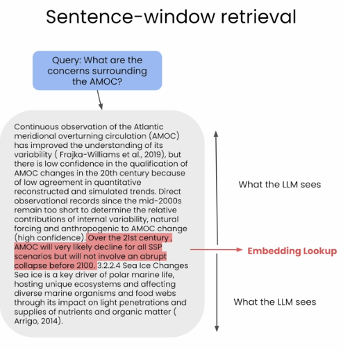

**Set up the node parser:**

```python
from llama_index.node_parser import SentenceWindowNodeParser

node_parser = SentenceWindowNodeParser.from_defaults(
    window_size=3,
    window_metadata_key="window",
    original_text_metadata_key="original_text",
)
```

**To replace the retrieved sentence with the context window:**

```python
from llama_index.indices.postprocessor import MetadataReplacementPostProcessor

postproc = MetadataReplacementPostProcessor(
    target_metadata_key="window"
)
```

**Reranking results to improve relevancy:**

```python
from llama_index.indices.postprocessor import SentenceTransformerRerank

rerank = SentenceTransformerRerank(
    top_n=2, model="BAAI/bge-reranker-base"
)
```

---

## 2. Auto Merging Retrieval

Organizes the document into a **tree-like structure** where each parent node's text is divided among its child nodes. When multiple child nodes are identified as relevant to a user's question, the entire text of the parent node is provided as context for the LLM.

> If a parent node has the majority of its child nodes retrieved, the retrieved child nodes will be replaced by the parent node.

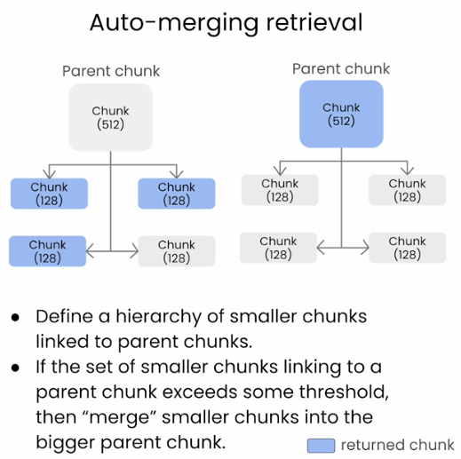

**Set up the hierarchical node parser:**

```python
from llama_index.node_parser import HierarchicalNodeParser

node_parser = HierarchicalNodeParser.from_defaults(
    chunk_sizes=[2048, 512, 128]
)
```

**Split documents into all levels:**

```python
nodes = node_parser.get_nodes_from_documents([document])
```

**To store all nodes across all hierarchy levels:**

```python
from llama_index import VectorStoreIndex, StorageContext

storage_context = StorageContext.from_defaults()
storage_context.docstore.add_documents(nodes)
```

**Building the index:**

```python
automerging_index = VectorStoreIndex(
    leaf_nodes,
    storage_context=storage_context,
    service_context=auto_merging_context
)
```

**Auto merging retriever:**

```python
from llama_index.retrievers import AutoMergingRetriever

automerging_retriever = automerging_index.as_retriever(
    similarity_top_k=12
)  # Retrieves top 12 small chunks

retriever = AutoMergingRetriever(
    automerging_retriever,
    automerging_index.storage_context,
    verbose=True
)  # If multiple retrieved chunks belong to same parent, it merges them into the parent node
```

---

## 3. Evaluation

We use **Feedback functions** to define evaluation metrics and a **TruLens recorder** to run and evaluate them.

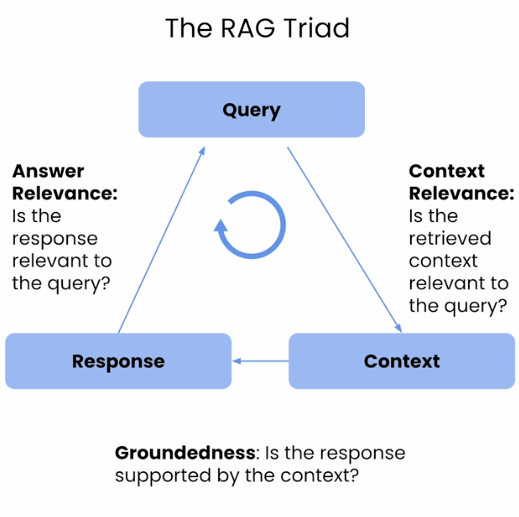

**Install TruLens:**

```bash
pip install trulens-eval
```

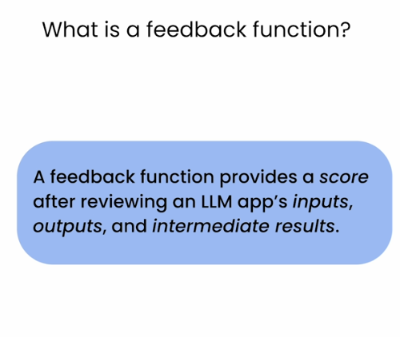

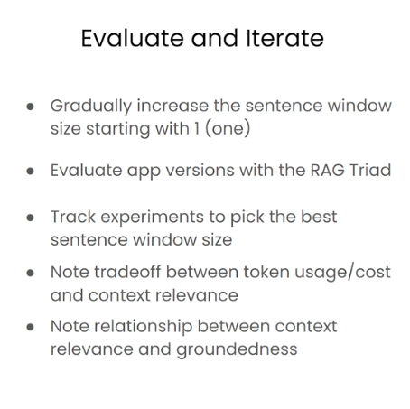

**Initialize TruLens and reset the database:**

```python
tru = Tru()          # initializes TruLens
tru.reset_database() # clears old evaluation logs
```

**Wrap with TruLens recorder:**

```python
tru_recorder = TruLlama(
    sentence_window_engine,
    app_id="App_1",
    feedbacks=[
        f_qa_relevance,
        f_qs_relevance,
        f_groundedness
    ]
)
```

**Run evaluation loop:**

```python
for question in eval_questions:
    with tru_recorder as recording:
        sentence_window_engine.query(question)
```

---

### 3.1 Context Relevance

Checks whether the **retrieved context is relevant to the given question**.

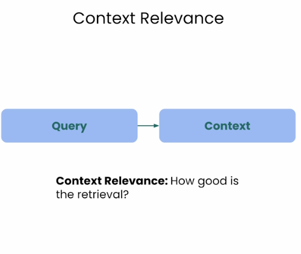

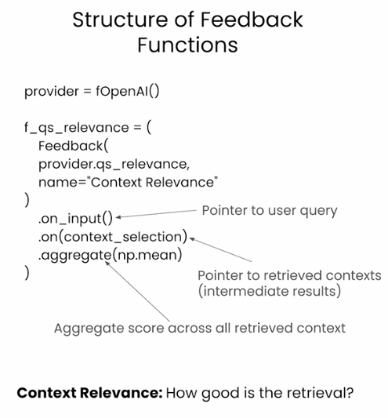

**Select retrieved context:**

```python
context_selection = TruLlama.select_source_nodes().node.text
```

**Define the context relevance feedback function:**

```python
f_qs_relevance = (
    Feedback(provider.qs_relevance_with_cot_reasons,
             name="Context Relevance")
    .on_input()
    .on(context_selection)
    .aggregate(np.mean)
)
```

---

### 3.2 Groundedness

Checks whether the **LLM response is supported by the retrieved context**.

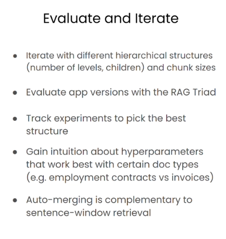

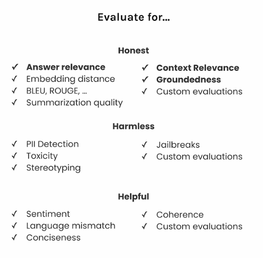

**Define the groundedness provider:**

```python
grounded = Groundedness(groundedness_provider=provider)
```

**Define the groundedness feedback function:**

```python
f_groundedness = (
    Feedback(grounded.groundedness_measure_with_cot_reasons,
             name="Groundedness"
    )
    .on(context_selection)
    .on_output()
    .aggregate(grounded.grounded_statements_aggregator)
)
```

---

### 3.3 Answer Relevance

Checks whether the **response is relevant to the original query**.

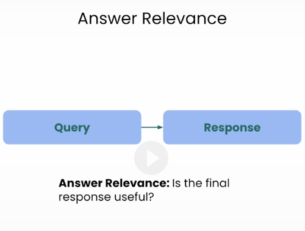

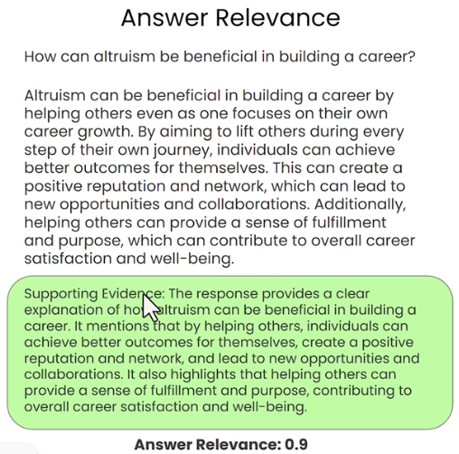

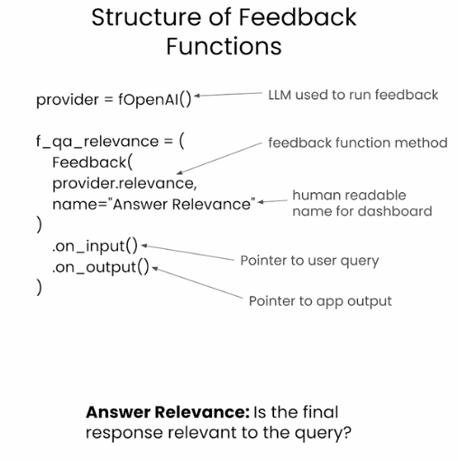

**Define the answer relevance feedback function:**

```python
f_qa_relevance = Feedback(
    provider.relevance_with_cot_reasons,
    name="Answer Relevance"
).on_input_output()
```

**Prebuilt recorder for evaluation:**

```python
tru_recorder = get_prebuilt_trulens_recorder(
    auto_merging_engine,
    app_id='app_0'
)
```
