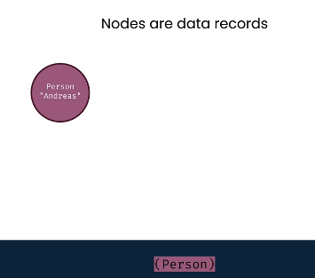
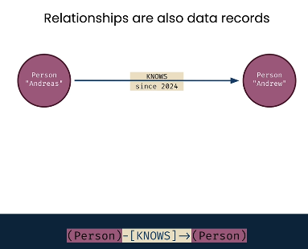
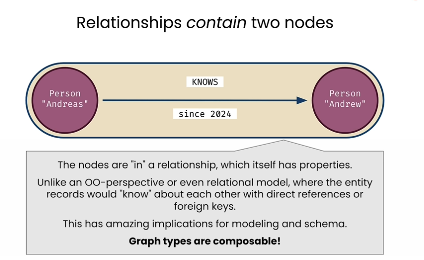
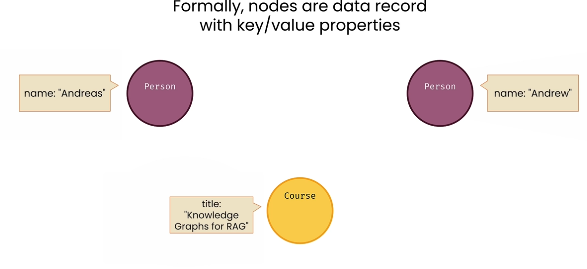
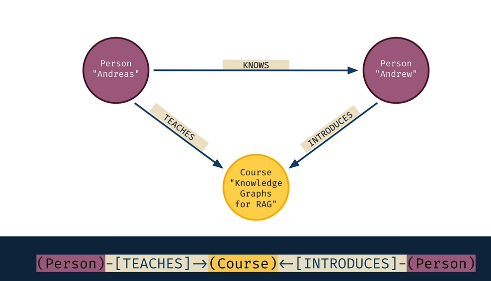
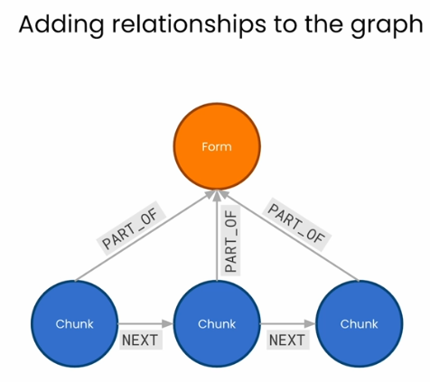

# 📚 Knowledge Graphs for RAG

## 📑 Table of Contents

1. [Knowledge Graph Fundamentals](#1-knowledge-graph-fundamentals)
2. [Querying Knowledge Graphs](#2-querying-knowledge-graphs)
3. [Constructing Knowledge Graph from Text Documents](#3-constructing-knowledge-graph-from-text-documents)
4. [Adding Relationships to a Knowledge Graph](#4-adding-relationships-to-a-knowledge-graph)
5. [RAG through Knowledge Graph in LlamaIndex](#5-rag-through-knowledge-graph-in-llamaindex)

---

## 1. Knowledge Graph Fundamentals

Knowledge graphs provide a way to store and organize data that emphasizes **relationships between things**.

**Nodes — Entity**



**Edge — Relationship**



Nodes and edges can store additional information about entity and relationship respectively.

Knowledge graphs make it much easier to represent and search deep relationships since **the relationship itself is a component of the database**, not just a key between 2 tables.

> **Use cases:** Web search engines and e-commerce sites.

In a knowledge graph, a relationship is actually a pair of nodes instead of information about 2 nodes.



**Nodes** have labels and key-value properties.



**Relationships** have direction, type, and properties.



> In conclusion, a knowledge graph is a database that stores information in **nodes** and **relationships**.

---

## 2. Querying Knowledge Graphs

We can query a knowledge graph using a query language called **"Cypher"**.

> Refer to code in `L2-query_with_cypher.ipynb` for query examples.

**Connect an AI framework to a graph database like Neo4j:**

```python
from llama_index.graph_stores.neo4j import Neo4jGraphStore

graph_store = Neo4jGraphStore(
    username="neo4j",
    password="your_password",
    url="bolt://localhost:7687",  # or Neo4j Aura URL
)
```

To query a knowledge graph using NLQ (Natural Language Query), we need to convert nodes and their properties into embeddings to perform a **similarity search** using general textual questions.

---

## 3. Constructing Knowledge Graph from Text Documents

We can convert a text document into a knowledge graph by first dividing the document into chunks (just like in RAG), and then converting those chunks into nodes of a graph using Cypher or other means.

```python
import pdfplumber
from langchain.text_splitter import RecursiveCharacterTextSplitter
from py2neo import Graph, Node

# Step 1: Load PDF and extract text
pdf_path = "./data/form10k/sample10k.pdf"
full_text = ""

with pdfplumber.open(pdf_path) as pdf:
    for page in pdf.pages:
        text = page.extract_text()
        if text:  # avoid None pages
            full_text += text + "\n"

# Step 2: Split text into chunks
text_splitter = RecursiveCharacterTextSplitter(
    chunk_size=2000,
    chunk_overlap=200,
    length_function=len,
    is_separator_regex=False,
)
chunks = text_splitter.split_text(full_text)

# Step 3: Add metadata to chunks
all_chunks = []
for i, chunk in enumerate(chunks):
    all_chunks.append({
        "chunk_id": f"{pdf_path}-chunk{i:04d}",
        "text": chunk,
        "source": pdf_path,
    })

# Step 4: Connect to Neo4j
graph = Graph("bolt://localhost:7687", auth=("neo4j", "password"))

# Ensure uniqueness on chunk_id
graph.run("CREATE CONSTRAINT IF NOT EXISTS ON (c:Chunk) ASSERT c.chunk_id IS UNIQUE")

# Step 5: Create nodes for each chunk
for chunk in all_chunks:
    node = Node(
        "Chunk",
        chunk_id=chunk["chunk_id"],
        text=chunk["text"],
        source=chunk["source"],
    )
    graph.merge(node, "Chunk", "chunk_id")

print(f"Inserted {len(all_chunks)} chunks into Neo4j.")
```

---

## 4. Adding Relationships to a Knowledge Graph



```python
from langchain_community.graphs import Neo4jGraph

# 1. CONNECT TO NEO4J
kg = Neo4jGraph(
    url="bolt://localhost:7687",
    username="neo4j",
    password="password"
)

# 2. CREATE FORM NODE
form_data = {
    "formId": "form123",
    "name": "Example Corp"
}
kg.query("""
MERGE (f:Form {formId: $formId})
SET f.name = $name
""", params=form_data)

# 3. CREATE CHUNK NODES
chunks = [
    {"id": "c1", "text": "NetApp provides cloud data services.", "seq": 0},
    {"id": "c2", "text": "It helps manage storage and data.", "seq": 1},
    {"id": "c3", "text": "It operates globally.", "seq": 2},
]

for chunk in chunks:
    kg.query("""
MERGE (c:Chunk {chunkId: $id})
SET c.text = $text,
    c.seq = $seq,
    c.formId = "form123"
""", params=chunk)

# 4. CREATE RELATIONSHIPS

# (a) Link chunks sequentially (NEXT)
for i in range(len(chunks) - 1):
    kg.query("""
MATCH (c1:Chunk {seq: $seq1}), (c2:Chunk {seq: $seq2})
MERGE (c1)-[:NEXT]->(c2)
""", params={"seq1": i, "seq2": i + 1})

# (b) Link chunks to form (PART_OF)
kg.query("""
MATCH (c:Chunk), (f:Form {formId: "form123"})
MERGE (c)-[:PART_OF]->(f)
""")

# 5. QUERY EXAMPLES

# Get first chunk
result1 = kg.query("""
MATCH (c:Chunk {seq: 0})
RETURN c.text AS text
""")
print("First chunk:", result1[0]["text"])

# Get next chunk using relationship
result2 = kg.query("""
MATCH (c1:Chunk {seq: 0})-[:NEXT]->(c2)
RETURN c2.text AS text
""")
print("Next chunk:", result2[0]["text"])

# Traverse full chain
result3 = kg.query("""
MATCH (c1:Chunk)-[:NEXT]->(c2:Chunk)
RETURN c1.text AS from, c2.text AS to
""")
print("\nAll NEXT relationships:")
for r in result3:
    print(f"{r['from']} --> {r['to']}")
```

---

## 5. RAG through Knowledge Graph in LlamaIndex

```python
# Setup the storage context
graph_store = SimpleGraphStore()
storage_context = StorageContext.from_defaults(graph_store=graph_store)

# Construct the Knowledge Graph Index
index = KnowledgeGraphIndex.from_documents(
    documents=documents,
    max_triplets_per_chunk=3,
    storage_context=storage_context,
    embed_model=embed_model,
    include_embeddings=True
)

"""
max_triplets_per_chunk : governs the number of relationship triplets processed per data chunk
include_embeddings     : toggles the inclusion of vector embeddings within the index for advanced analytics.
"""

# Asking questions on a knowledge graph index
query = "What is ESOP?"

query_engine = index.as_query_engine(
    include_text=True,
    response_mode="tree_summarize",
    embedding_mode="hybrid",
    similarity_top_k=5,
)

message_template = f"""<|system|>Please check if the following pieces of context has any mention of the keywords provided in the Question. If not then don't know the answer, just say that you don't know. Stop there. Please do not try to make up an answer.</s>
<|user|>
Question: {query}
Helpful Answer:
</s>"""

response = query_engine.query(message_template)

print(response.response.split("<|assistant|>")[-1].strip())
```
