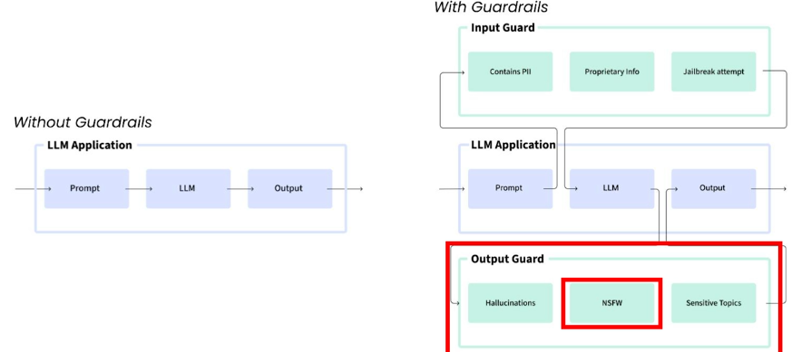
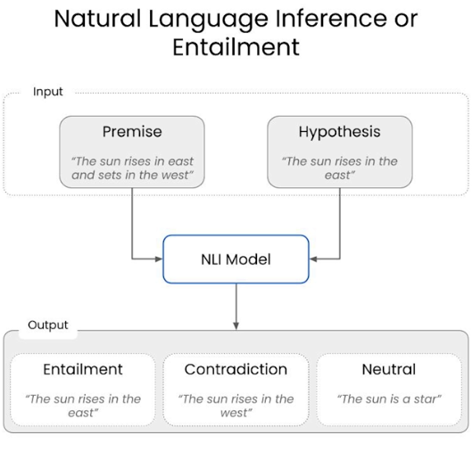
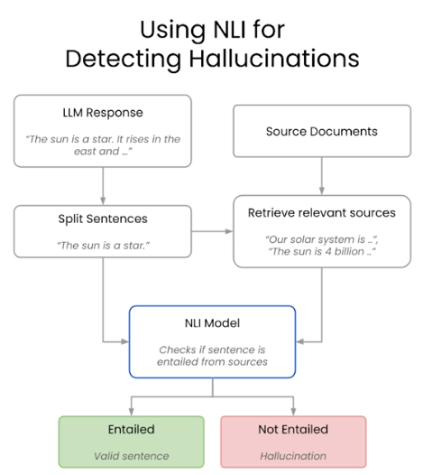
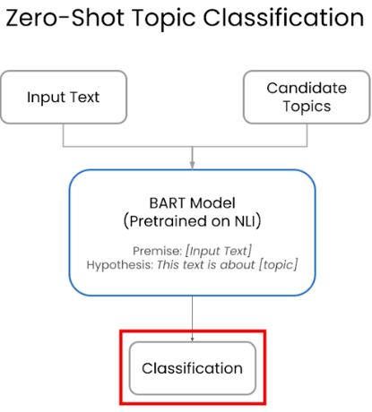
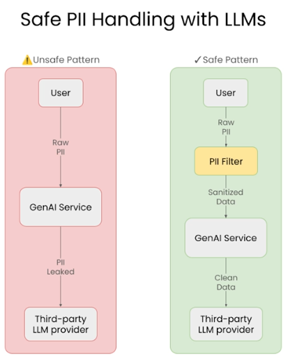
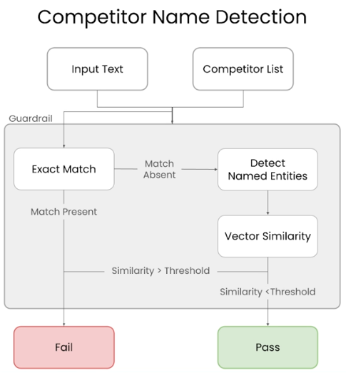

# 🛡️ Safe and Reliable AI via Guardrails

> A reference guide covering guardrails techniques for RAG applications — including hallucination detection, topic constraints, PII prevention, and competitor mention filtering.

---

## 📑 Table of Contents

1. [Failure Modes in RAG Applications](#1-failure-modes-in-rag-applications)
2. [What are Guardrails](#2-what-are-guardrails)
3. [How are Guardrails Implemented](#3-how-are-guardrails-implemented)
4. [How Guardrails in AI Application Helps](#4-how-guardrails-in-ai-application-helps)
5. [Building a Guardrail](#5-building-a-guardrail)
   - [5.1 Example](#51-example)
6. [Checking for Hallucinations](#6-checking-for-hallucinations)
   - [6.1 Example](#61-example)
   - [6.2 Overall Flow Summary](#62-overall-flow-summary)
   - [6.3 Using a Guardrail Directly vs Creating a Guard](#63-using-a-guardrail-directly-vs-creating-a-guard)
7. [Keeping a Chatbot on Topic](#7-keeping-a-chatbot-on-topic)
   - [7.1 Example of Keeping Chatbot on Topic](#71-example-of-keeping-chatbot-on-topic)
8. [Ensuring No Personal Identifiable Information (PII) is Leaked](#8-ensuring-no-personal-identifiable-information-pii-is-leaked)
   - [8.1 What is PII](#81-what-is-pii)
   - [8.2 LLM Data Privacy Risks](#82-llm-data-privacy-risks)
   - [8.3 Example of Preventing PII Leakage](#83-example-of-preventing-pii-leakage)
9. [Preventing Competitor Mentions](#9-preventing-competitor-mentions)
   - [9.1 Example](#91-example)

---

## 1. Failure Modes in RAG Applications

- **Hallucination** — model generates a response even when the information is not available in the knowledge base
- **Prompt injection** — when user tries to override the system prompt by user input
- **PII exposure** — when chat history stores sensitive data like PII which violates compliance and may be exposed due to a data leakage
- **Competitor mention** — user prompt can try to force comparison with a competitor and make model generate fabricated comparisons which may violate business rules

---

## 2. What are Guardrails

A secondary check or validation around the input or output of an LLM model.

Validity could mean no hallucinations, no PII leakage, robustness to jailbreaking, etc.



---

## 3. How are Guardrails Implemented?

- **Rules or Heuristic Systems** — Regular Expressions, Pattern Matching, Keywords / Filters
- **Small Finetuned ML models** — Classification, factuality, topic detection, named entity recognition
- **Secondary LLM call** — score of toxicity, rate tone of voice, verify coherence

---

## 4. How Guardrails in AI Application Helps

- **Limit worse case behavior** — explicitly verify that the inviolatable constraints for our application are not violated
- **Measure the occurrence of undesirable behavior** — measure LLM refusals, log guardrails violations
- **Build more complex AI workflows** — each intermediate step is constrained and reliable

---

## 5. Building a Guardrail

### 5.1 Example

**Imports:**

```python
from guardrails import (
    Guard, # central object in guardrails, intercepts requests before they reach the LLM
    OnFailAction # defines what happens when validation fails
)

from guardrails.validator_base import (
    Validator, # base call for all custom validators, we subclass this to define our rules
    ValidationResult, # base return type for validation
    PassResult, # Indicates validation success, request continues
    FailResult, # Indicates validation failure, return error and provide a fix value
    register_validator # decorator, registers our validator with guardrails
)
```

**Load knowledge base:**

```python
documents = SimpleDirectoryReader("shared_data/").load_data()
index = VectorStoreIndex.from_documents(documents)
query_engine = index.as_query_engine()
```

**System prompt:**

```python
SYSTEM_PROMPT = """
You are a customer support chatbot for Alfredo's Pizza Cafe.

Rules:
- Only answer questions related to Alfredo's Pizza Cafe
- Only use provided knowledge
- If unsure, politely say you don't know
- Do not discuss other restaurants
"""
```

**Create a simple Guardrails validator:**

```python
@register_validator(name="detect_colosseum", data_type="string") # registers a validator
class ColosseumValidator(Validator):
    def _validate(self, value, metadata=None) -> ValidationResult: # validator logic
        if "colosseum" in value.lower(): # Simple keyword detection
            return FailResult( # Fails validation
                error_message="Colosseum detected",
                fix_value="Sorry, I cannot answer questions about Project Colosseum." # replacement response
            )
        return PassResult() # if keyword not present, validation passes
```

**Wrapping the validator in a Guard:**

```python
guard = Guard().use( # Guard() creates guard instance, .use(..) attaches a validator
    ColosseumDetector(
        on_fail=OnFailAction.EXCEPTION # throw an error if validation fails
    ),
    on="messages" # apply to user messages
)
```

**Using guardrails server** (Intermediate layer where our LLM requests go):

```python
guarded_client = OpenAI(
    base_url="http://127.0.0.1:8000/guards/colosseum_guard/openai/v1/"
)
```

**Alternate way to fix failure:**

```python
colosseum_guard_2 = Guard(name="colosseum_guard_2").use(
    ColosseumDetector(on_fail=OnFailAction.FIX), # input replaced in backend
    on="messages"
)
```

---

## 6. Checking for Hallucinations

Hallucinations in this context refer to lack of groundedness — responses by LLM that are not supported by our data sources or input context.

We check for hallucinations in LLM response through a technique called **Natural Language Inference**.




### 6.1 Example

**After building the RAG knowledge base, setup NLI model (for hallucination detection):**

```python
entailment_model = 'GuardrailsAI/finetuned_nli_provenance' # open source model by guardrails to detect hallucinations (entailment, contradiction, neutral)
NLI_PIPELINE = pipeline("text-classification", model=entailment_model)
```

**Building hallucination validator:**

```python
# registering the validator
@register_validator(name="hallucination_detector", data_type="string")
class HallucinationValidation(Validator):

    # Initialize all the models and data needed to detect hallucinations
    def __init__(
        self,
        embedding_model: Optional[str] = None,
        entailment_model: Optional[str] = None,
        sources: Optional[List[str]] = None,
        **kwargs # passed to the base validator class
    ):
        # embedding model initialization
        if embedding_model is None:
            embedding_model = 'all-MiniLM-L6-v2'
        self.embedding_model = SentenceTransformer(embedding_model)

        # storing the sources (list of trusted reference documents)
        self.sources = sources

        # entailment model initialization
        if entailment_model is None:
            entailment_model = 'GuardrailsAI/finetuned_nli_provenance'
        self.nli_pipeline = pipeline("text-classification", model=entailment_model)

        # call to parent constructor
        super().__init__(**kwargs)

    # validate method (core logic)
    def validate(self, value: str, metadata: Optional[Dict[str, str]] = None) -> ValidationResult:
        sentences = self.split_sentences(value) # hallucination detection works sentence by sentence

        # find relevant sources for each sentence
        relevant_sources = self.find_relevant_sources(sentences, self.sources)

        entailed_sentences = []
        hallucinated_sentences = []

        for sentence in sentences:
            # Check if the sentence is entailed by the sources
            is_entailed = self.check_entailment(sentence, relevant_sources)
            if not is_entailed:
                hallucinated_sentences.append(sentence)
            else:
                entailed_sentences.append(sentence)

        if len(hallucinated_sentences) > 0:
            return FailResult(
                error_message=f"The following sentences are hallucinated: {hallucinated_sentences}",
            )
        return PassResult()

    # sentence splitting helper
    def split_sentences(self, text: str) -> List[str]:
        if nltk is None:
            raise ImportError(
                "This validator requires the `nltk` package. "
                "Install it with `pip install nltk`, and try again."
            )
        return nltk.sent_tokenize(text)

    # find relevant sources with embeddings
    def find_relevant_sources(self, sentences: str, sources: List[str]) -> List[str]:
        source_embeds = self.embedding_model.encode(sources)
        sentence_embeds = self.embedding_model.encode(sentences)
        relevant_sources = []
        for sentence_idx in range(len(sentences)):
            # Find the cosine similarity between the sentence and the sources
            sentence_embed = sentence_embeds[sentence_idx, :].reshape(1, -1)
            cos_similarities = np.sum(np.multiply(source_embeds, sentence_embed), axis=1)
            # Find the top 5 sources that are most relevant to the sentence that have a cosine similarity greater than 0.8
            top_sources = np.argsort(cos_similarities)[::-1][:5]
            top_sources = [i for i in top_sources if cos_similarities[i] > 0.8]
            # Return the sources that are most relevant to the sentence
            relevant_sources.extend([sources[i] for i in top_sources])
        return relevant_sources

    # entailment checking
    def check_entailment(self, sentence: str, sources: List[str]) -> bool:
        for source in sources:
            output = self.nli_pipeline({'text': source, 'text_pair': sentence})
            if output['label'] == 'entailment':
                return True
        return False
```

### 6.2 Overall Flow Summary

```
Generated text
↓
Split into sentences
↓
Find relevant sources using embeddings
↓
Check entailment using NLI
↓
Fail if any sentence is unsupported
```

### 6.3 Using a Guardrail Directly vs Creating a Guard

**Using guardrail directly:**
- Quick implementation
- Direct access to guardrail data without abstraction — you receive: raw validation results, error objects, intermediate metadata

**Creating a guard:**
- Run multiple guardrails on the same LLM request in parallel
- Streaming support
- OpenAI compatible protected LLM endpoints — endpoints on which guards are running
- Out of the box logging capabilities — guard automatically logs LLM inputs, outputs, validate failures, etc.

**Using hallucination guard in an application:**

Create a guard for the validator we made previously:

```python
guard = Guard().use(
    HallucinationValidation(
        sources=[...],
        on_fail=OnFailAction.EXCEPTION
    )
)
```

**Guardrails server integration:**

```python
guarded_client = OpenAI( # routes openai API calls through guardrails server
    base_url="http://localhost:8000/guards/hallucination_guard/openai/v1/"
)
```

---

## 7. Keeping a Chatbot on Topic

How do we check if our input is related to the use case of a chatbot or application — we use a NLI model where we pass our input text as premise and hypothesis is that the input text is about a certain topic.

After that our model classifies for entailment and contradiction.


### 7.1 Example of Keeping Chatbot on Topic

After setting up the RAG pipeline, setup a zero shot classifier (classifies text into labels, uses NLI):

```python
CLASSIFIER = pipeline(
    "zero-shot-classification",
    model='facebook/bart-large-mnli',
    hypothesis_template="This sentence above contains discussions of the following topics: {}.",
    multi_label=True,
)
```

**Another way to classify topic (LLM classification):**

```python
class Topics(BaseModel): # uses a LLM and structured output reinforcement
    detected_topics: list[str]
```

**Creating a function to detect topics using above classifier:**

```python
def detect_topics(
    text: str,
    topics: List[str],
    threshold: float = 0.8,
) -> List[str]:
    result = CLASSIFIER(text, topics)
    return [
        label
        for label, score in zip(result["labels"], result["scores"])
        if score >= threshold
    ]
```

**Creating guardrail that filters out specific topic using the above function:**

```python
@register_validator(name="constrain_topic", data_type="string")
class ConstrainTopic(Validator):
    def __init__(
        self,
        banned_topics: Optional[List[str]] = None,
        threshold: float = 0.8,
        **kwargs
    ):
        self.banned_topics = banned_topics or []
        self.threshold = threshold
        super().__init__(**kwargs)

    def _validate(
        self,
        value: str,
        metadata: Optional[dict] = None
    ) -> ValidationResult:
        detected = detect_topics(
            value,
            self.banned_topics,
            self.threshold
        )
        if detected:
            return FailResult(
                error_message=f"Banned topics detected: {detected}"
            )
        return PassResult()
```

**Create guard using the above guardrail:**

```python
guard = Guard(name='topic_guard').use(
    ConstrainTopic(
        banned_topics=["politics", "automobiles"],
        on_fail=OnFailAction.EXCEPTION,
    ),
)
```

**RAG + guarded chat function:**

```python
def chat(user_input: str) -> str:
    # 1. Guardrail validation
    topic_guard.validate(user_input)

    # 2. Retrieve context
    retrieval_response = query_engine.retrieve(user_input)
    context = "\n\n".join(
        [node.node.text for node in retrieval_response]
    )

    # 3. Construct messages
    messages = [
        {"role": "system", "content": SYSTEM_MESSAGE},
        {
            "role": "user",
            "content": f"""
Context:
{context}

User Question:
{user_input}
"""
        },
    ]

    # 4. LLM call
    completion = openai_client.chat.completions.create(
        model="gpt-4o-mini",
        messages=messages,
        temperature=0.2,
    )
    return completion.choices[0].message.content
```

**Testing example:**

```python
print(chat("What pizzas are available at Alfredo's?"))
```

---

## 8. Ensuring No Personal Identifiable Information (PII) is Leaked

### 8.1 What is PII

- **Direct identifiers** — Name, SSN, email address
- **Indirect identifiers** — location, demographics
- **Sensitive information** — Health records, financial information

### 8.2 LLM Data Privacy Risks

- Third party processing exposure
- Potential data retention by providers
- Limited control over data handling
- Risk of training data contamination



For detecting PII, we use **Microsoft Presidio**, a data protection and de-identification SDK.

### 8.3 Example of Preventing PII Leakage

**Microsoft Presidio imports:**

```python
from presidio_analyzer import AnalyzerEngine # detects PII entities
from presidio_anonymizer import AnonymizerEngine # masks or replaces detected entities
```

**Setup a RAG pipeline as usual, then setup Presidio:**

```python
presidio_analyzer = AnalyzerEngine()
presidio_anonymizer = AnonymizerEngine()
```

**Function to detect PII (custom function):**

```python
def detect_pii(text: str) -> List[str]:
    results = presidio_analyzer.analyze(
        text=text,
        language="en",
        entities=["PERSON", "PHONE_NUMBER", "EMAIL_ADDRESS"],
    )
    return [result.entity_type for result in results]

# Anonymization Helper
def anonymize_text(text: str) -> str:
    analysis = presidio_analyzer.analyze(text=text, language="en")
    anonymized = presidio_anonymizer.anonymize(
        text=text,
        analyzer_results=analysis
    )
    return anonymized.text
```

**Creating a guardrail:**

```python
@register_validator(name="pii_detector", data_type="string")
class PIIDetector(Validator):
    def _validate(
        self,
        value: Any,
        metadata: Dict[str, Any] = {}
    ):
        detected = detect_pii(value)
        if detected:
            return FailResult(
                error_message=f"PII detected: {', '.join(detected)}",
                metadata={"pii": detected},
            )
        return PassResult()
```

**Creating a guard:**

```python
input_guard = Guard(name="input_pii_guard").use(
    PIIDetector(on_fail=OnFailAction.EXCEPTION)
)
```

**Guarded chat wrapper:**

```python
def guarded_chat(prompt: str):
    # Validate BEFORE calling LLM or retriever
    input_guard.validate(prompt)
    # Safe to proceed
    return chat_engine.chat(prompt)
```

**Test guarded input:**

```python
try:
    guarded_chat(
        "My name is Hank Tate and my phone number is 555-123-4567"
    )
except Exception as e:
    print(e)
```

**Real time stream validation to validate the output of LLM:**

```python
from guardrails.hub import DetectPII # Output guard

output_guard = Guard().use(
    DetectPII(
        pii_entities=["PHONE_NUMBER", "EMAIL_ADDRESS"],
        on_fail="fix"
    )
)

# Streaming response with output validation
llm_stream = output_guard(
    model="gpt-3.5-turbo",
    messages=[
        {"role": "system", "content": "You are a chatbot."},
        {
            "role": "user",
            "content": (
                "Write a paragraph about an unnamed protagonist "
                "including a random 10-digit phone number."
            ),
        },
    ],
    stream=True,
)

validated_text = ""
for chunk in llm_stream:
    validated_text += chunk.validated_output
    print(validated_text)
    time.sleep(0.5)
```

---

## 9. Preventing Competitor Mentions



We detect competitor mentions by **exact matching** and **vector similarity matching**.

### 9.1 Example

**Setup a RAG pipeline as usual.**

Our validator will use a specialized **Named Entity Recognition** model to check against a list of competitors:

```python
from typing import Optional, List

# to automatically load tokenizer and NER model
from transformers import AutoTokenizer, AutoModelForTokenClassification, pipeline

from sentence_transformers import SentenceTransformer # create dense vector embeddings
from sklearn.metrics.pairwise import cosine_similarity
import numpy as np
import re
```

**Initializing NER pipeline:**

```python
# dslim is fine tuned for Organization, location, people
tokenizer = AutoTokenizer.from_pretrained("dslim/bert-base-NER")
model = AutoModelForTokenClassification.from_pretrained("dslim/bert-base-NER")
NER = pipeline("ner", model=model, tokenizer=tokenizer)
```

**Competitor mention validator:**

```python
@register_validator(name="check_competitor_mentions", data_type="string")
class CheckCompetitorMentions(Validator):
    def __init__(self, competitors: List[str], **kwargs):
        super().__init__(**kwargs)
        self.competitors = competitors
        self.competitors_lower = [c.lower() for c in competitors]
        self.ner = NER_PIPELINE
        self.embedder = SentenceTransformer("all-MiniLM-L6-v2")
        self.competitor_embeddings = self.embedder.encode(competitors)
        self.similarity_threshold = 0.6

    def exact_match(self, text: str) -> List[str]:
        text_lower = text.lower()
        matches = []
        for comp, comp_lower in zip(self.competitors, self.competitors_lower):
            if re.search(rf"\b{re.escape(comp_lower)}\b", text_lower):
                matches.append(comp)
        return matches

    def extract_entities(self, text: str) -> List[str]:
        ner_results = self.ner(text)
        entities, current = [], ""
        for token in ner_results:
            if token["entity"].startswith("B-"):
                if current:
                    entities.append(current.strip())
                current = token["word"]
            elif token["entity"].startswith("I-"):
                current += " " + token["word"]
        if current:
            entities.append(current.strip())
        return entities

    def vector_similarity_match(self, entities: List[str]) -> List[str]:
        if not entities:
            return []
        entity_embeddings = self.embedder.encode(entities)
        sims = cosine_similarity(entity_embeddings, self.competitor_embeddings)
        matches = []
        for i, ent in enumerate(entities):
            if np.max(sims[i]) >= self.similarity_threshold:
                matches.append(
                    self.competitors[np.argmax(sims[i])]
                )
        return matches

    def validate(self, value: str, metadata: Optional[dict] = None):
        exact_matches = self.exact_match(value)
        if exact_matches:
            return FailResult(
                error_message=f"Response mentions competitors: {', '.join(exact_matches)}"
            )

        entities = self.extract_entities(value)
        similarity_matches = self.vector_similarity_match(entities)
        if similarity_matches:
            return FailResult(
                error_message=f"Response references competitors: {', '.join(similarity_matches)}"
            )

        return PassResult()
```

**Run guardrails server:**

```python
guarded_client = OpenAI(
    base_url='http://localhost:8000/guards/competitor_check/openai/v1/'
)

# Initialize guarded RAG chatbot
guarded_rag_chatbot = RAGChatWidget(
    client=guarded_client,
    system_message=system_message,
    vector_db=vector_db,
)

# test run
guarded_rag_chatbot.display("message")
```
