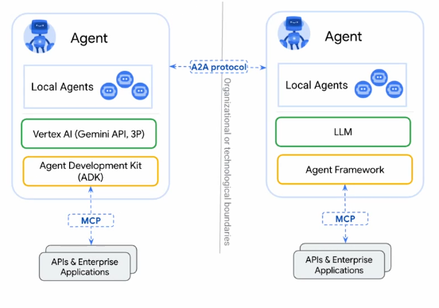
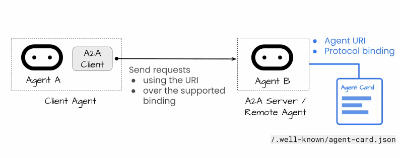
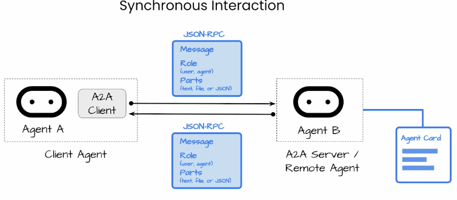
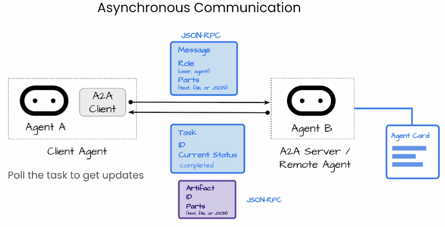
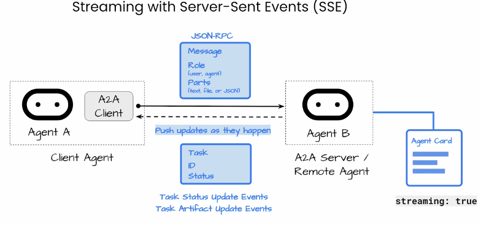
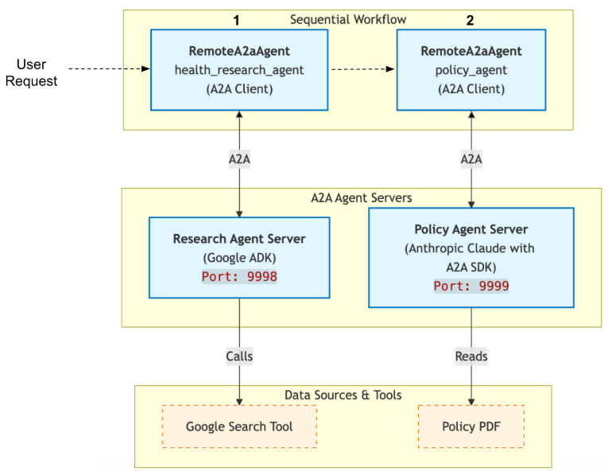
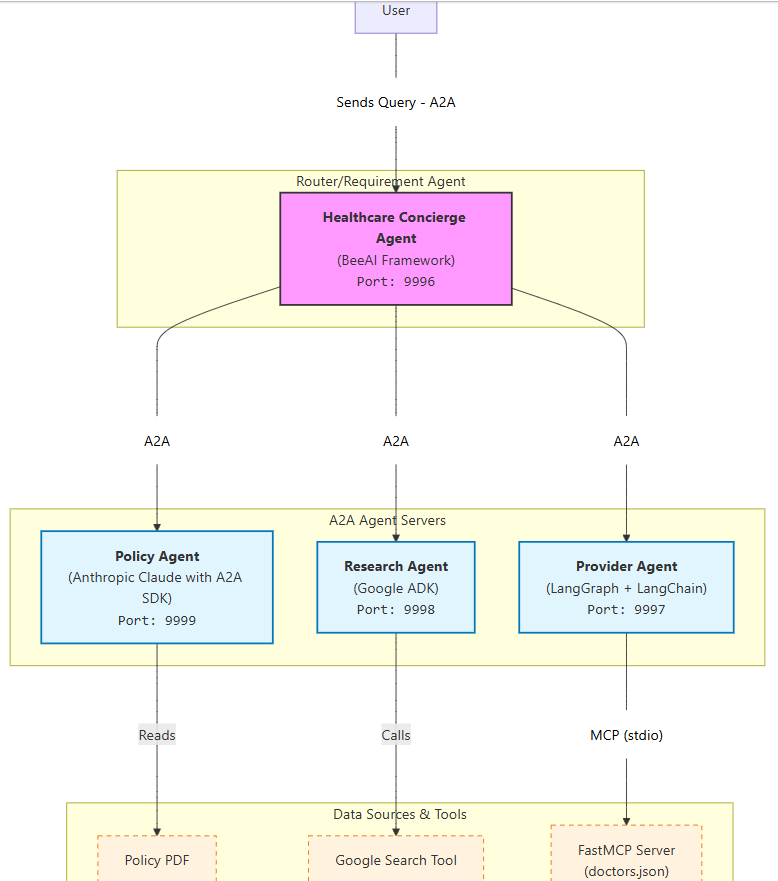
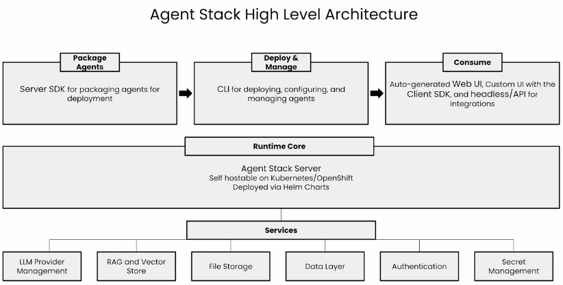
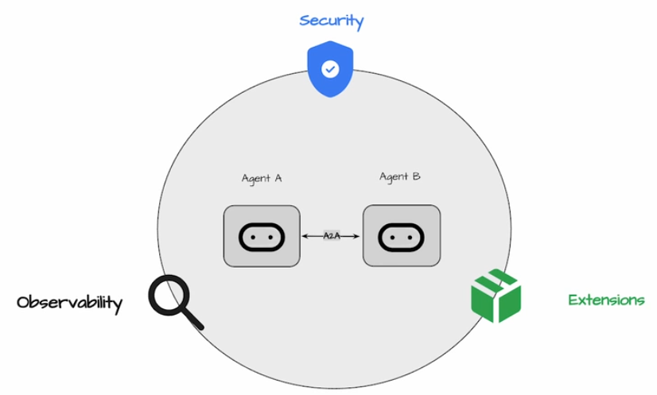

# 🤖 A2A: Agent2Agent Protocol

> A reference guide covering the Agent2Agent (A2A) open protocol — including A2A capabilities, architecture, communication modes, agent wrapping, multi-agent systems, and advanced concepts.

---

## 📑 Table of Contents

1. [A2A](#1-a2a)
2. [A2A Capabilities](#2-a2a-capabilities)
3. [A2A vs MCP](#3-a2a-vs-mcp)
4. [A2A Architecture](#4-a2a-architecture)
   - [4.1 How Agents Discover Each Other](#41-how-agents-discover-each-other)
   - [4.2 How Agents Actually Communicate](#42-how-agents-actually-communicate)
5. [Execution Modes](#5-execution-modes)
   - [5.1 Synchronous](#51-synchronous)
   - [5.2 Asynchronous](#52-asynchronous)
   - [5.3 Streaming](#53-streaming)
   - [5.4 Push Notifications](#54-push-notifications)
6. [Wrapping an AI Agent into an A2A Server](#6-wrapping-an-ai-agent-into-an-a2a-server)
7. [Calling an A2A Agent Using an A2A Client](#7-calling-an-a2a-agent-using-an-a2a-client)
8. [Creating an A2A Agent Using Google ADK](#8-creating-an-a2a-agent-using-google-adk)
9. [Creating an A2A Sequential Chain Agent with ADK](#9-creating-an-a2a-sequential-chain-agent-with-adk)
10. [Creating a Multi Agent System Using A2A](#10-creating-a-multi-agent-system-using-a2a)
11. [Running A2A Agents on Agent Stack](#11-running-a2a-agents-on-agent-stack)
12. [Advanced A2A Concepts](#12-advanced-a2a-concepts)

---

## 1. A2A

A2A is a shared open protocol open standard that allows agents from different developers, built on different frameworks, and owned by different organizations to unite and work together.

---

## 2. A2A Capabilities

- A2A agents can dynamically discover each other
- Agents can collaborate via standardized tasks
- Agents can share content with enterprise grade security
- Every agent is opaque — implementation details don't need to be exposed to follow the protocol

---

## 3. A2A vs MCP

**MCP** — connects agents to tools, APIs and resources
> Ex: Agent uses MCP to call a weather API tool

**A2A** — facilitates dynamic communication between different agents as peers
> Ex: A travel agent asks a flight agent to find flights



---

## 4. A2A Architecture

A2A utilizes standard web technologies like HTTP, JSON-RPC, gRPC and Server Sent Events (SSE) to communicate between independent systems.

### 4.1 How Agents Discover Each Other

Each A2A agent must publish an **agent card**, which is a JSON file typically hosted at the well-known URL on the agent server.

An agent card tells other agents everything they need to know to start a communication, which includes:

- Agent's name
- What it can do
- Which version of the protocol it's using
- The URI and protocol bindings
- What media types it supports
- Any special capabilities like streaming, push notifications and custom extensions
- How to authenticate

### 4.2 How Agents Actually Communicate

Agent B's card says what URI and protocol bindings should be used. So Agent A can send requests to Agent B using that URI over whichever binding is supported. The protocol supports JSON-RPC, gRPC, and the HTTP JSON for a REST-like interface.

---

## 5. Execution Modes

Agents can communicate using four execution modes.

### 5.1 Synchronous

Waiting for an immediate response.

To start communicating synchronously, Agent A will first send a **message object**, wrapped in a send message request using the `message send` method.

- A **Message** represents one turn in the conversation, like Agent A asking a question. It has a Role (user/agent) and contains **Parts**.
- A **Part** is the actual content — it could be plain text, a file, multimodal data, or structured JSON data.

If the request is simple and completes quickly, Agent B can respond directly to Agent A with a message containing the response.



### 5.2 Asynchronous

Proceeding without blocking for a reply.

Instead of a message, Agent B can respond with a **task object**. A Task is the job an agent needs to do.

A Task has:
- An **ID**
- A **context ID** which matches one of the message
- A **Status** indicating the current state of the Task Lifecycle: `submitted`, `working`, `input_required` (if Agent B needs more information from the end user), and terminal states `completed` or `failed`

Agent A sends its initial request, Agent B responds with a task ID and current status. Agent A can then poll the `task get` method to get updates.

Agent B decides whether to return a task or a message, and Agent A needs to handle either case. Eventually, the task get method will return the task as `completed`, and the task outputs will be in the **artifacts** field.

**Artifacts** are structures similar to messages — they have an Artifact ID and Parts, which contain the actual response content.



### 5.3 Streaming

Transmitting continuous data flows.

If Agent B's card says it supports streaming, Agent A can use the `message stream` method. The connection stays open and Agent B can push updates to Agent A as they happen.

These updates can be:
- The initial task object
- Task status update events
- Messages like "I'm now working on part X" or "the task is now completed"
- Task artifact update events — if the result is large (like a long summary), Agent B can stream it in chunks

Users can see live progress updates or the answer can appear as it is being generated.



### 5.4 Push Notifications

Alerting the other agent when specific events occur.

You can use webhook push notifications with the `task push notification configs set` method, or add this configuration when sending the first message.

Agent A provides a **callback URL** and Agent B will actively push a notification to that URL when the task state changes or an artifact is ready.



---

## 6. Wrapping an AI Agent into an A2A Server

**Imports**

```python
# AgentExecutor- for handling A2A requests
# RequestContext- contains details about an incoming A2A request (user input, metadata, conversation context)
from a2a.server.agent_execution import AgentExecutor, RequestContext

# A2AStarletteApplication- readymade starlette app configured for A2A, handles agent discovery, skill exposure, message routing
from a2a.server.apps import A2AStarletteApplication

# EventQueue- event based communication channel, used to send responses back, supports async
from a2a.server.events import EventQueue

# DefaultRequestHandler- glue between HTTP requests, task storage and agentExecutor. Manages lifecycle of a request
from a2a.server.request_handlers import DefaultRequestHandler

# InMemoryTaskStore- Stores tasks and convos in RAM, not persistent
from a2a.server.tasks import InMemoryTaskStore

# AgentSkill- describes what the agent can do, used for discovery by other agents
# AgentCard- describes who the agent is, public metadata endpoint (/.well-known/agent.json), required by A2A protocol
# AgentCapabilities- Technical capabilities (ex- streaming support)
from a2a.types import (
    AgentCapabilities,
    AgentCard,
    AgentSkill,
)

# new_agent_text_message- utility to build a properly formatted a2a message, ensures our response matches protocol schema
from a2a.utils import new_agent_text_message
```

**Bridging A2A → Agent**

```python
# this class connects A2A request → Your AI agent → A2A response
class PolicyAgentExecutor(AgentExecutor):

    # create an instance of our agent
    def __init__(self) -> None:
        self.agent = PolicyAgent()  # PolicyAgent is a class of our agent from other file

    # Handling requests- this method is called automatically whenever a request arrives
    async def execute(
        self,
        context: RequestContext,
        event_queue: EventQueue,
    ) -> None:
        prompt = context.get_user_input()           # extract user message from request
        response = self.agent.answer_query(prompt)  # calls your agent business logic
        message = new_agent_text_message(response)  # wraps raw text into a2a compliant message
        await event_queue.enqueue_event(message)    # sends response back to caller
```

**Server Setup**

```python
def main() -> None:
    print(f"Running A2A Health Insurance Policy Agent")
    _ = load_dotenv()

    # Configure host and port
    PORT = int(os.environ.get("POLICY_AGENT_PORT", 9999))
    HOST = os.environ.get("AGENT_HOST", "localhost")

    # define agent skill (what agent can do)
    skill = AgentSkill(
        id="insurance_coverage",
        name="Insurance coverage",
        description="Provides information about insurance coverage options and details.",
        tags=["insurance", "coverage"],
        examples=["What does my policy cover?", "Are mental health services included?"],
    )

    # define agent card (who the agent is), this is exposed at /.well-known/agent.json
    agent_card = AgentCard(
        name="InsurancePolicyCoverageAgent",
        description="Provides information about insurance policy coverage options and details.",
        url=f"http://{HOST}:{PORT}/",
        version="1.0.0",
        default_input_modes=["text"],
        default_output_modes=["text"],
        capabilities=AgentCapabilities(streaming=False),
        skills=[skill],
    )

    # request handler and task store
    request_handler = DefaultRequestHandler(  # RequestHandler → orchestrates everything
        agent_executor=PolicyAgentExecutor(),  # AgentExecutor → business logic
        task_store=InMemoryTaskStore(),        # TaskStore → conversation/task tracking
    )
```

**Create and Run A2A Server**

```python
    server = A2AStarletteApplication(
        agent_card=agent_card,
        http_handler=request_handler,
    )

    uvicorn.run(server.build(), host=HOST, port=PORT)

if __name__ == '__main__':
    main()
```

---

## 7. Calling an A2A Agent Using an A2A Client

**Imports**

```python
from a2a.client import (
    Client,         # Represents a connected A2A agent, Used to send messages and fetch metadata
    ClientConfig,   # Configuration for the client, Allows injecting a custom HTTP client (httpx)
    ClientFactory,  # Responsible for connecting to an A2A server, Hides protocol handshake & setup details
    create_text_message_object,  # Helper to create a proper A2A Message, Ensures correct schema and metadata
)

# Message- a direct agent response
# Task- represents a structured action
# Artifact- Output produced by a task, May contain generated text, files, or other data
from a2a.types import AgentCard, Artifact, Message, Task

from a2a.utils.message import get_message_text  # safely extracts text from Message and Artifact
```

**Client Configuration**

```python
_ = load_dotenv()

# load agent address and keep client code environment agnostic
host = os.environ.get("AGENT_HOST", "localhost")
port = os.environ.get("POLICY_AGENT_PORT")

prompt = "How much would I pay for mental health therapy?"
```

**Run the Client Interaction**

```python
async with httpx.AsyncClient(timeout=100.0) as httpx_client:  # Creates an async HTTP client for all network calls

    # Step 1: Create a client
    # Connects to the A2A server, Verifies the agent endpoint, Prepares protocol handlers
    client: Client = await ClientFactory.connect(
        f"http://{host}:{port}",
        client_config=ClientConfig(
            httpx_client=httpx_client,
        ),
    )

    # Step 2: Discover the agent by fetching its card
    agent_card = await client.get_card()
    display_agent_card(agent_card)

    # Step 3: Create the message using a convenient helper function (valid a2a message object)
    message = create_text_message_object(content=prompt)
    display(Markdown(f"**Sending prompt:** `{prompt}` to the agent..."))

    # Step 4: Send the message and await the final response.
    responses = client.send_message(message)
    text_content = ""

    # Step 5: Process the responses from the agent
    async for response in responses:
        if isinstance(response, Message):
            # The agent replied directly with a final message
            print(f"Message ID: {response.message_id}")
            text_content = get_message_text(response)

        # response is a ClientEvent (task + artifact)
        elif isinstance(response, tuple):
            task: Task = response[0]
            print(f"Task ID: {task.id}")
            if task.artifacts:
                artifact: Artifact = task.artifacts[0]
                print(f"Artifact ID: {artifact.artifact_id}")
                text_content = get_message_text(artifact)

    display(Markdown("### Final Agent Response\n-----"))
    if text_content:
        display(Markdown(text_content))
    else:
        display(
            Markdown(
                """**No final text content received or task did not 
                complete successfully.**"""
            )
        )
```

---

## 8. Creating an A2A Agent Using Google ADK

Refer to `L6.ipynb`

**Important feature in Google ADK:**

```python
from google.adk.a2a.utils.agent_to_a2a import to_a2a
```

Takes an **ADK agent** and returns a **fully A2A-compliant server application**.

Auto-creates:
- AgentCard
- Executor
- Request handler
- HTTP routes

---

## 9. Creating an A2A Sequential Chain Agent with ADK



Connect agents running on different servers using A2A.

**Start Agent A server**

```bash
uv run a2a_policy_agent.py
```

**Start Agent B server**

```bash
uv run a2a_research_agent.py
```

**Imports**

```python
# SequentialAgent - A workflow agent from Google ADK, Runs multiple agents in a fixed order, Output of agent 1 → input for agent 2 → etc
from google.adk.agents import SequentialAgent

# RemoteA2aAgent- Acts as an A2A client, Connects to an agent that is running on a remote server, Communicates using the A2A protocol
from google.adk.agents.remote_a2a_agent import RemoteA2aAgent

# InMemoryRunner- Executes the agent workflow in memory, No database or persistence
from google.adk.runners import InMemoryRunner
```

**Creating Remote Agents**

```python
# agent A
policy_agent = RemoteA2aAgent(  # creates a client side representation of policy agent
    name="policy_agent",
    agent_card=f"http://{host}:{policy_port}",  # agent card is the url of the running agent server
)

# agent B
health_research_agent = RemoteA2aAgent(
    name="health_research_agent",
    agent_card=f"http://{host}:{research_port}",
)
```

**Creating the SequentialAgent**

```python
root_agent = SequentialAgent(  # root agent controls the workflow
    name="root_agent",
    description="Healthcare Routing Agent",
    sub_agents=[  # output from one agent feeds into other agent
        health_research_agent,
        policy_agent,
    ],
)
```

**Run the Sequential Chain**

```python
prompt = "How can I get mental health therapy?"

print("Running Healthcare Workflow Agent")

runner = InMemoryRunner(root_agent)  # runner setup

for event in await runner.run_debug(prompt, quiet=True):  # running the workflow
    if event.is_final_response() and event.content:
        display(Markdown(event.content.parts[0].text))
```

---

## 10. Creating a Multi Agent System Using A2A

Building an orchestrator agent that:

- Does **routing + reasoning**
- Uses **three separate A2A agents**: Policy Agent, Research Agent, Provider Agent
- Is built using **BeeAI Framework**
- Uses **A2A** to talk to all subagents
- Can **itself** be exposed as an A2A agent



We use BeeAI Framework for the orchestrator agent for:
- Explicit routing rules
- Forced reasoning steps
- Tool usage constraints
- Production observability through middleware
- Cross-framework agents

**Imports**

```python
# A2AAgent- A BeeAI wrapper around remote A2A agents, Similar idea to: Google RemoteA2aAgent
from beeai_framework.adapters.a2a.agents import A2AAgent

# VertexAIChatModel- LLM wrapper for Google Gemini, Used by the Concierge agent, not subagents
from beeai_framework.adapters.vertexai import VertexAIChatModel

# RequirementAgent- The orchestrator, Decides: Which tools to call, Which agents to hand off to
from beeai_framework.agents.requirement import RequirementAgent

# ConditionalRequirement- Enforces rules about tool usage, Example: "Don't call tools consecutively"
from beeai_framework.agents.requirement.requirements.conditional import ConditionalRequirement

# UnconstrainedMemory- Stores conversation state
from beeai_framework.memory import UnconstrainedMemory

from beeai_framework.middleware.trajectory import EventMeta, GlobalTrajectoryMiddleware
from beeai_framework.tools import Tool

# HandoffTool- Wraps a remote A2A agent, Allows the LLM to "call" that agent like a tool
from beeai_framework.tools.handoff import HandoffTool

# ThinkTool- Lets the LLM reason explicitly, Used for structured reasoning / planning
from beeai_framework.tools.think import ThinkTool
```

**Custom Middleware**

```python
# BeeAI logs all internal reasoning - This middleware: Strips extra logs, Shows tool calls only
class ConciseGlobalTrajectoryMiddleware(GlobalTrajectoryMiddleware):

    def _format_prefix(self, meta: EventMeta) -> str:
        prefix = super()._format_prefix(meta)
        return prefix.rstrip(": ")

    def _format_payload(self, value: Any) -> str:
        return ""
```

**Create A2A Clients for Subagents**

```python
policy_agent = A2AAgent(
    url=f"http://{host}:{policy_agent_port}",
    memory=UnconstrainedMemory()
)

# Run `check_agent_exists()` to fetch and populate AgentCard
asyncio.run(policy_agent.check_agent_exists())
print("\tℹ️", f"{policy_agent.name} initialized")

research_agent = A2AAgent(
    url=f"http://{host}:{research_agent_port}",
    memory=UnconstrainedMemory()
)

asyncio.run(research_agent.check_agent_exists())
print("\tℹ️", f"{research_agent.name} initialized")
```

**Configuring the Orchestrator Agent**

```python
# Creating the RequirementAgent
healthcare_agent = RequirementAgent(
    name="Healthcare Agent",
    description="""A personal concierge for Healthcare Information, 
    customized to your policy.""",

    # LLM Configuration (Vertex AI)
    llm=VertexAIChatModel(
        model_id="gemini-2.5-flash",
        project=project_id,
        location="global",
        allow_parallel_tool_calls=True,
        allow_prompt_caching=False,
        settings={
            "api_base": f"{os.getenv('GOOGLE_VERTEX_BASE_URL')}",
            "use_psc_endpoint_format": True,
        }
    ),

    # tools attached
    tools=[
        thinktool := ThinkTool(),
        policy_tool := HandoffTool(
            target=policy_agent,
            name=policy_agent.name,
            description=policy_agent.agent_card.description,
        ),
        research_tool := HandoffTool(
            target=research_agent,
            name=research_agent.name,
            description=research_agent.agent_card.description,
        ),
        provider_tool := HandoffTool(
            target=provider_agent,
            name=provider_agent.name,
            description=provider_agent.agent_card.description,
        ),
    ],

    # Requirements (rules)
    requirements=[
        ConditionalRequirement(
            thinktool, force_at_step=1, force_after=Tool,
            consecutive_allowed=False
        ),
    ],
    role="Healthcare Concierge",
    instructions=(
        f"""You are a concierge for healthcare services. Your task is 
        to handoff to one or more agents to answer questions and provide 
        a detailed summary of their answers. Be sure that all of their 
        questions are answered before responding.
        Use `{policy_agent.name}` to answer insurance-related questions.
        
        IMPORTANT: When returning answers about providers, only output 
        providers from `{provider_agent.name}` and only provide insurance 
        information based on the results from `{policy_agent.name}`.
        In your output, put which agent gave you the information!"""
    ),
)

print("\tℹ️", f"{healthcare_agent.meta.name} initialized")
```

**Run the Full Workflow**

```python
response = await healthcare_agent.run(
    """I'm based in Austin, TX. How do I get mental health therapy near me 
    and what does my insurance cover?"""
).middleware(ConciseGlobalTrajectoryMiddleware())

display(Markdown(response.last_message.text))
```

**Registering the Agent with A2A Server**

```python
    # Register the agent with the A2A server and run the HTTP server
    # we use LRU memory manager to keep limited amount of sessions in the memory
    A2AServer(
        config=A2AServerConfig(port=healthcare_agent_port, protocol="jsonrpc", host=host),
        memory_manager=LRUMemoryManager(maxsize=100),
    ).register(healthcare_agent, send_trajectory=True).serve()

if __name__ == "__main__":
    main()
```

**Run the agent**

```bash
uv run a2a_healthcare_agent.py
```

**Calling the agent as a client**

```python
agent = A2AAgent(url="http://127.0.0.1:9996")
response = await agent.run("...")
```

---

## 11. Running A2A Agents on Agent Stack

For moving from local development to production deployment we need to take care of many things:

- Storage and file management
- LLM inference integration
- Vector database for RAG
- Deployment requirement
- Security and authentication
- End user facing interface

**Agent Stack** provides self-hostable infrastructure for agents that is optimized for speed, flexibility and control:

- Open source
- No vendor lock-in
- Framework agnostic



**How to run an agent on Agent Stack:**

Create an instance of agent stack server:

```python
server = Server()
```

Use `@server.agent` decorator to bind the agent to agent stack:

```python
@server.agent(name="Healthcare Agent"
….
```

> Read about agent stack further from the agent stack documentation.

**For deployment**, run in terminal:

```bash
agentstack add repo-link
```

**For getting a list of currently deployed agents:**

```bash
agentstack list
```

---

## 12. Advanced A2A Concepts



### Security (Authentication & Transport Protection)

**What it solves:**
Prevents unauthorized agents from accessing sensitive systems, data, or incurring costs.

**How A2A handles it:**

- **TLS / HTTPS is mandatory** — all production agent communication must be encrypted in transit to protect data.
- **Authentication is declared in the AgentCard** — each agent publishes a *security schema* describing how it must be called.
- **Supported authentication methods**: API keys, OAuth 2.0, OpenID Connect (OIDC)
- **Automatic credential handling**: The calling agent reads the remote agent's AgentCard, obtains the required token from an identity provider, and sends it as a Bearer token in the Authorization header. This is handled by an **AuthInterceptor**, not manually coded headers.

**Why it matters:**
Agents can reliably identify *who* is calling them and decide whether to answer or return errors like **403 Forbidden**, enabling enterprise-grade access control.

---

### Extensibility (Custom Data Without Breaking the Protocol)

**What it solves:**
Allows you to support domain-specific or experimental requirements without fragmenting the protocol.

**How A2A handles it:**

- A2A defines **strict schemas** for interoperability
- Instead of modifying standard fields, A2A provides an **extensions field**
- Extensions exist in: AgentCards, Messages, Tasks
- Extensions are **arbitrary key–value dictionaries**

**Example:**

```json
{
  "extensions": {
    "x-billing-cost": 0.25,
    "latency-target-ms": 200
  }
}
```

**Key rule:** Agents **must ignore extensions they don't understand**, not crash or fail.

**Why it matters:**
- Maintains backward compatibility
- Enables innovation without coordination bottlenecks
- Anyone can define and publish new extensions
- Supports advanced use cases like billing, QoS, feature flags, or compliance data

---

### Observability (Debugging & Distributed Tracing)

**What it solves:**
Helps you understand failures or latency across complex multi-agent chains.

**Why this is hard:**
A single request might flow through:

> Concierge agent → Research agent → Search agent → Policy agent

When something breaks, it's hard to know *where*.

**How A2A helps:**

- A2A aligns with **distributed tracing standards** like OpenTelemetry
- A **Trace ID** is passed in request headers
- That ID travels across every agent in the chain

**Result:** Full end-to-end visibility of a request's lifecycle. Compatible with tracing tools such as: Jaeger, Zipkin, Google Cloud Trace, and Arize (for LLM & agent observability).

**Why it matters:**
- Rapid debugging
- Performance analysis
- Cross-organization visibility
- Production-grade reliability

---

## GitHub Repositories

- https://github.com/a2aproject
- https://github.com/a2aproject/a2a-samples
