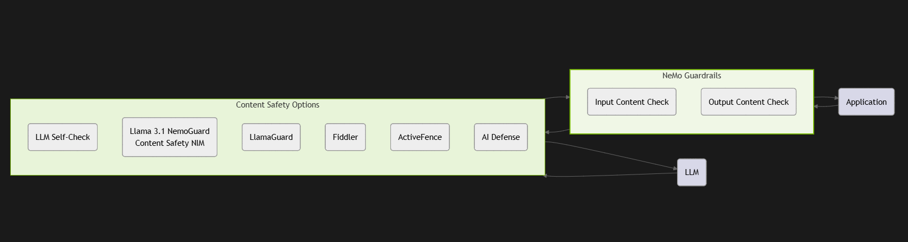
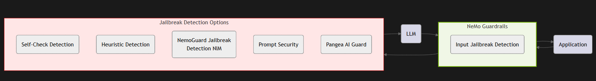
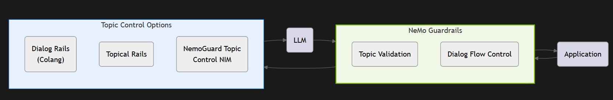
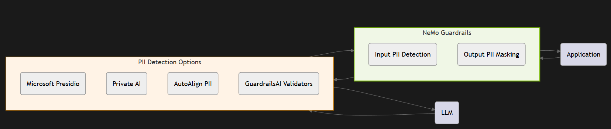
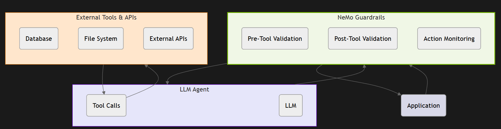
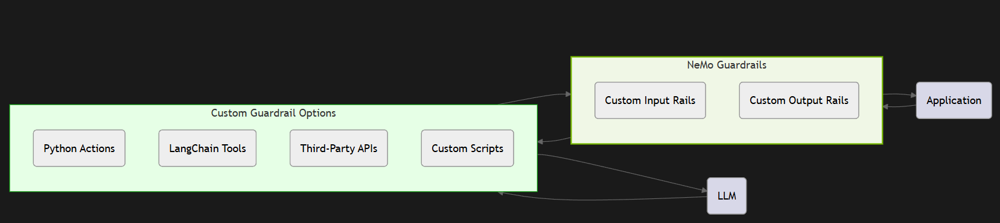
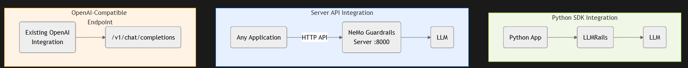
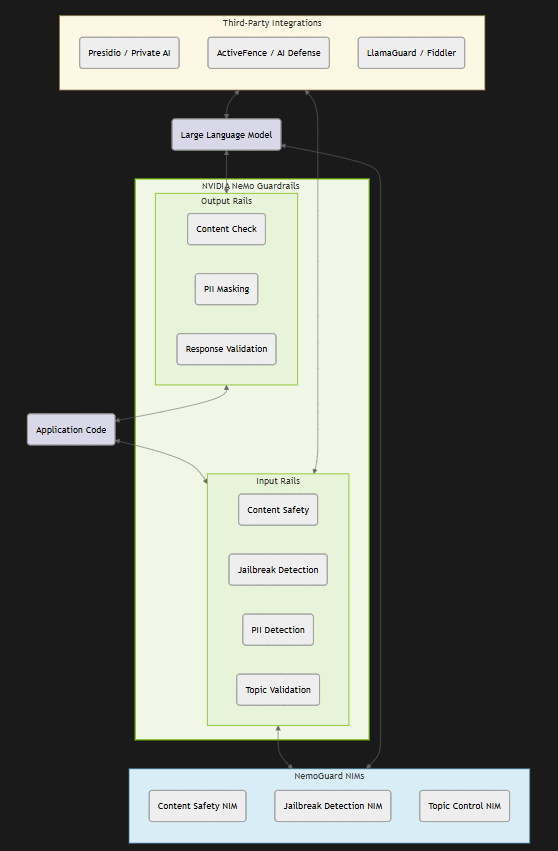

# 📊 Guardrails Sequence Diagrams and Use Case Diagrams

> Visual reference for understanding NeMo Guardrails architecture, master flow, and individual use case summaries.

---

## 📑 Table of Contents

1. [Master Rails Flow Diagram](#1-master-rails-flow-diagram)
2. [Use Case Diagrams](#2-use-case-diagrams)

---

## 1. Master Rails Flow Diagram

---

## 2. Use Case Diagrams

- **Content safety** — Content safety guardrails check both user inputs and LLM outputs for harmful content.

- **Jailbreak protection** — Jailbreak protection prevents adversarial attempts from bypassing safety measures.

- **Topic control** — Topic control ensures conversations stay within predefined subject boundaries.

- **PII detection and masking** — PII detection protects user privacy by detecting and masking sensitive data.

- **Agentic security** — Agentic security provides guardrails for LLM agents using tools and external systems.

- **Custom and third-party guardrails** — Build custom guardrails using Python actions, LangChain tools, or third-party APIs.

- **Integration options** — Multiple integration options: Python SDK, HTTP Server API, or OpenAI-compatible endpoint.

- **Combined architecture overview** — A unified view of how all guardrail components work together in a production system.

