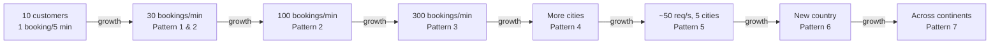
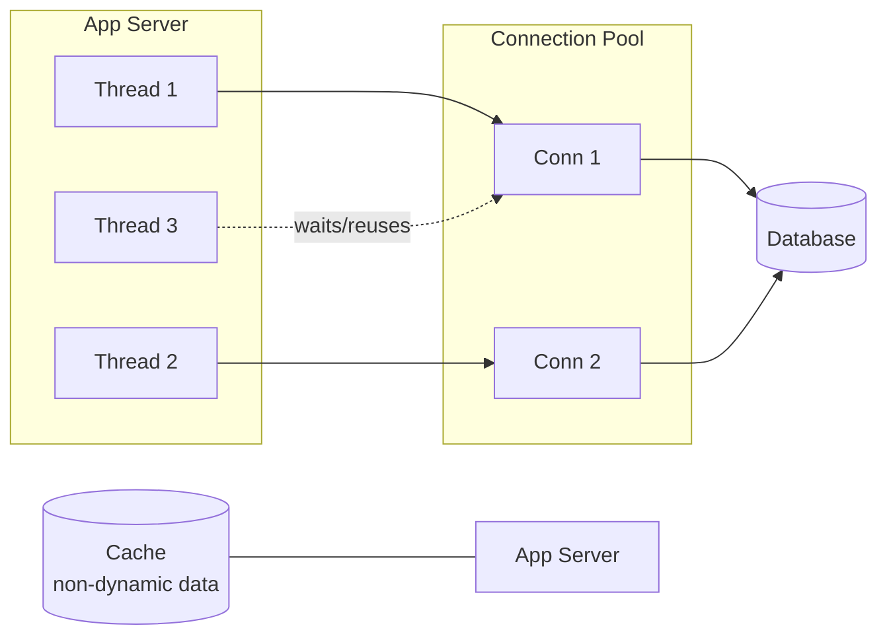
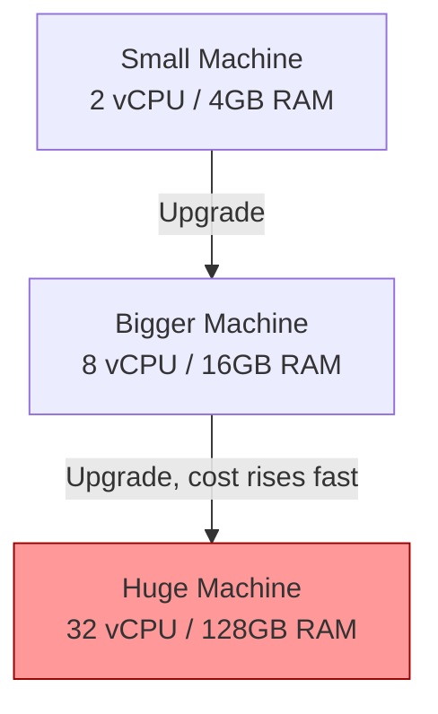
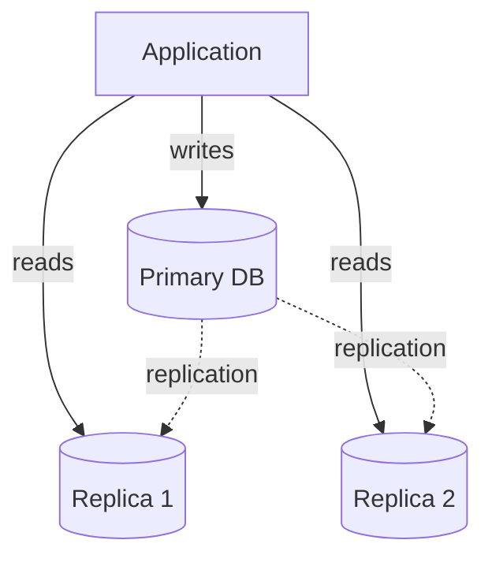
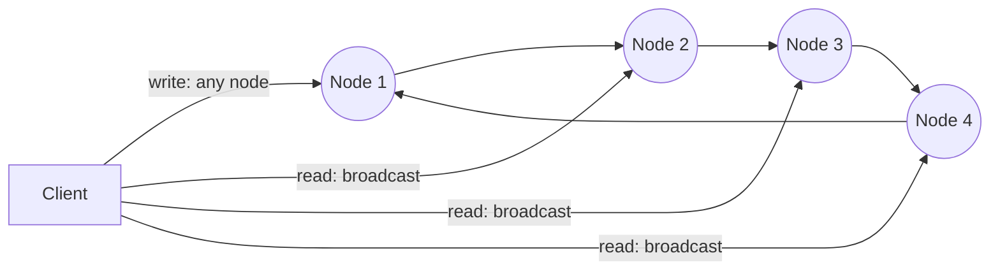
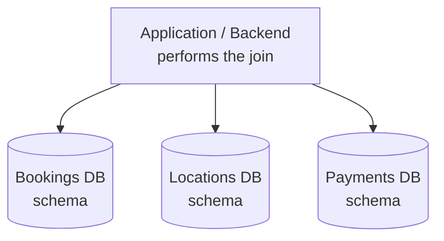
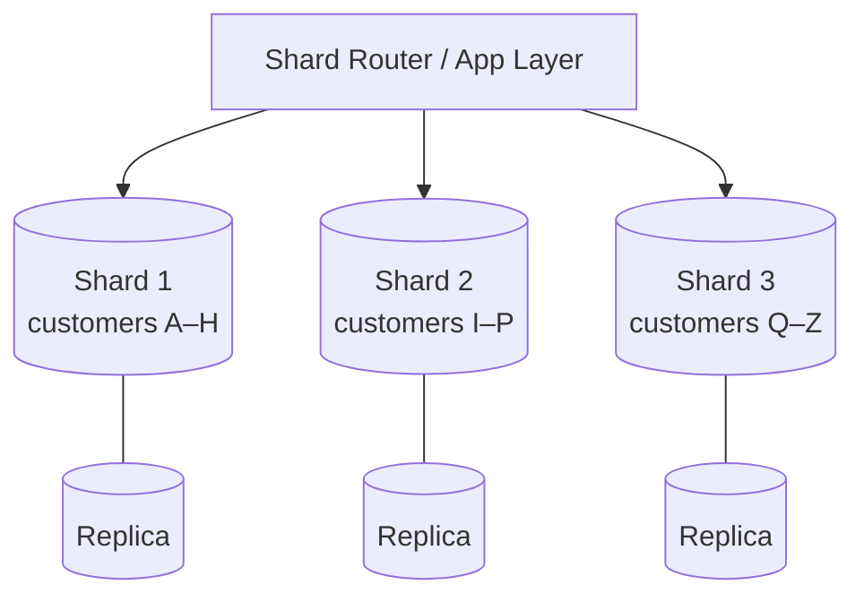
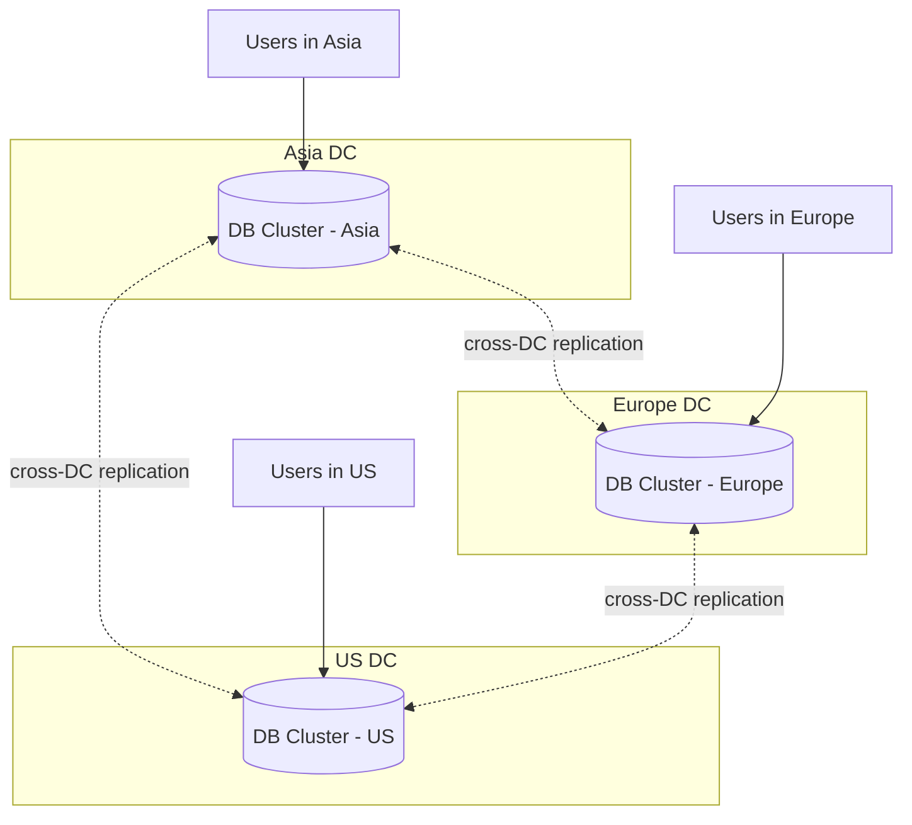

# Database Scaling Patterns

---

## Table of Contents

1. [Case Study — Cab Booking App](#1-case-study--cab-booking-app)
   - 1.1 [The Problem Begins](#11-the-problem-begins)
2. [Pattern 1: Query Optimisation & Connection Pool Implementation](#2-pattern-1-query-optimisation--connection-pool-implementation)
3. [Pattern 2: Vertical Scaling (Scale-up)](#3-pattern-2-vertical-scaling-scale-up)
4. [Pattern 3: CQRS (Command Query Responsibility Segregation)](#4-pattern-3-cqrs-command-query-responsibility-segregation)
5. [Pattern 4: Multi-Primary Replication](#5-pattern-4-multi-primary-replication)
6. [Pattern 5: Partitioning of Data by Functionality](#6-pattern-5-partitioning-of-data-by-functionality)
7. [Pattern 6: Horizontal Scaling (Scale-out / Sharding)](#7-pattern-6-horizontal-scaling-scale-out--sharding)
8. [Pattern 7: Data Centre Wise Partition](#8-pattern-7-data-centre-wise-partition)
9. [Summary — Which Pattern, When](#9-summary--which-pattern-when)

---

## 1. Case Study — Cab Booking App

- Tiny startup, **~10 customers** onboard.
- A **single small machine** hosts the DB — it stores all customers, trips, locations, booking data, and customer trip history.
- Load: **~1 trip booking every 5 minutes**.

At this stage a single machine is more than enough — there's no scaling problem yet.

### 1.1 The Problem Begins

The app becomes popular, and requests scale up to **30 bookings/minute**. This exposes the limits of the tiny single-machine setup:

- The DB starts **performing poorly**.
- **API latency increases** significantly.
- Transactions face **deadlocks, starvation, and frequent failures**.
- The app experience becomes **sluggish**.
- Customers get **dissatisfied**.

**The fix isn't "buy the biggest server and stop worrying" — it's a series of patterns, applied one at a time, each one bought only when the previous one runs out of headroom.** This is what the rest of this document walks through, step by step.

---

## 2. Pattern 1: Query Optimisation & Connection Pool Implementation

The first fix isn't more hardware — it's using the existing machine efficiently.

- **Cache frequently used, non-dynamic data** — booking history, payment history, user profiles, etc. — so the DB isn't hit for the same read repeatedly.
- **Introduce database redundancy** (duplicate some data across tables, or bring in a NoSQL store for specific access patterns) to avoid expensive joins on every request.
- **Use connection pool libraries** to cache/reuse DB connections instead of opening a fresh one per request.
- **Multiple application threads share the same DB connection** from the pool rather than each grabbing its own.

> **Q&A — What is dynamic vs. non-dynamic data (in this context)?**
>
> | Type | Meaning | Examples |
> |---|---|---|
> | **Non-dynamic data** | Doesn't change often (or changes in a predictable, append-only way); safe to cache for a while | Booking history, payment history, user profile details |
> | **Dynamic data** | Changes frequently / needs to be fresh on every read | Live cab location, current trip status, real-time availability |
>
> The rule of thumb: cache the non-dynamic data aggressively; fetch dynamic data straight from the DB (or a fast in-memory store built for that purpose).

> **Q&A — What is the concept of pooling?**
>
> Opening a new DB connection for every request is expensive (TCP handshake, auth, session setup). A **connection pool** opens a fixed set of DB connections up front and keeps them alive. When a request needs the DB, it borrows a connection from the pool, uses it, and returns it — instead of creating and destroying a connection each time. Multiple application threads take turns using the same pooled connections, which cuts down connection-setup overhead drastically.

**Result:** Good enough to scale the business to one more city — **~100 bookings/minute**.

---

## 3. Pattern 2: Vertical Scaling (Scale-up)

Once optimisation alone isn't enough, the next lever is upgrading the existing machine itself:

- Upgrade the tiny machine's hardware — e.g. **RAM ×2**, **SSD ×3**, more CPU cores.
- Scale-up is **pocket-friendly only up to a point**.
- Beyond that point, **cost increases exponentially** for each extra unit of performance (bigger machines are disproportionately more expensive, and there's a hardware ceiling).

**Result:** Good enough to expand to 3 more cities — **~300 bookings/minute**.

---

## 4. Pattern 3: CQRS (Command Query Responsibility Segregation)

Even the biggest single machine eventually can't handle all reads **and** writes together. CQRS separates them onto different physical machines:

- Add **2 more machines as replicas** of the primary.
- **All read queries** go to the replicas.
- **All write queries** go to the primary.
- As the business grows further (2 more cities), the **primary can't keep up with all write requests**, and the **replication lag between primary and replicas** starts to noticeably hurt the user experience (reads may return slightly stale data).

**Limitation reached:** single primary is now a write bottleneck, and lag is visible to users.

---

## 5. Pattern 4: Multi-Primary Replication

The next idea: why should only one node accept writes? Let every node accept both reads and writes.

- **Every machine acts as both primary and replica** — reads and writes can both be performed on any node.
- The multi-primary set is arranged as a **logical circular ring**.
- **Writes** can go to any node.
- **Reads**: the request is **broadcast** to all nodes, and whichever node **replies first** is used to answer.

> **Q&A — How does Pattern 4 actually work (from my notes)?**
>
> All machines — including what used to be "replicas" — now work as both primary and replica, meaning both read and write operations can be performed on any of them. When data is written to one node, that same data is **replicated to the other nodes in a circular fashion** (around the ring). For a read request, the request is **broadcast** to the nodes, and whichever node **replies first** has its answer returned to the client.

**Result:** Scales to 5 more cities, but the system is back in pain at **~50 requests/second** — a single logical dataset replicated everywhere is now the bottleneck, not the write path.

---

## 6. Pattern 5: Partitioning of Data by Functionality

Instead of replicating *everything* everywhere, split the database by what the tables are actually used for:

- E.g., pull the **location tables** out into their **own separate DB schema**.
- That separated DB can live on **its own machine(s)**, using primary-replica or multi-primary configuration internally.
- Different functional groups of data live in **different databases**, each independently scaled.
- The trade-off: the **application/backend layer now has to join results itself** across these separate databases, since the DB engine can no longer do that join for you.

> **Q&A — What's the idea behind Pattern 5 (from my notes)?**
>
> A database contains many tables, and typically one group of tables serves a particular functionality while another group serves a different functionality (e.g., booking tables vs. location tables vs. payment tables). For optimization, these functional groups can be split into **separate, independent DB schemas** — each one scaled and tuned on its own. The cost of this is that any query needing data from two different functional groups now has to be **joined in the application layer**, not the database.

**Trigger for next step:** planning to expand the business to **another country**.

---

## 7. Pattern 6: Horizontal Scaling (Scale-out / Sharding)

Functional partitioning only splits data by *type*. To scale a single huge functional dataset itself, split it by *rows* — this is **sharding**:

- Data is split across **multiple shards** — e.g., **50 machines**, all running the **same DB schema**, but each machine holds only **a part of the data**.
- **Locality of data** matters — related data (e.g., all of one customer's records) should ideally live on the same shard, to avoid cross-shard joins.
- Each shard machine can have **its own replicas**, useful for failure recovery.
- Sharding is **generally hard to apply** correctly (choosing a shard key, rebalancing, cross-shard queries) — but it's necessary at this scale: **"No Pain, No Gain."**

**Trigger for next step:** scaling the business **across continents**.

---

## 8. Pattern 7: Data Centre Wise Partition

Sharding within one region doesn't help once users are spread across the globe — physical distance itself becomes the bottleneck:

- Requests **travelling across continents** suffer from **high latency** purely due to physical distance.
- Solution: **distribute traffic across data centres**, i.e. place data centres **across continents**, close to the users they serve.
- Enable **cross data centre replication**.

> **Q&A — What is cross data centre replication?**
>
> It's the practice of continuously **copying data between data centres located in different regions/continents**, so that each data centre has (close to) a full, up-to-date copy of the data it needs. This serves two purposes: it lets users be served by the **nearest** data centre (low latency), and if one data centre goes down, another one already has the data and can take over — which is what gives you **disaster recovery**.

- This pattern is primarily what **always maintains the Availability** of the system (in CAP-theorem terms), even in the face of regional outages.

---

## 9. Summary — Which Pattern, When

| # | Pattern | Solves | Trigger to move to next pattern |
|---|---|---|---|
| 1 | Query Optimisation + Connection Pooling | Wasted DB round-trips, repeated connections | Still hitting single-machine limits at ~100 bookings/min |
| 2 | Vertical Scaling | Raw hardware capacity | Cost of scaling up grows exponentially at ~300 bookings/min |
| 3 | CQRS | Reads/writes competing for the same machine | Primary can't handle all writes; replication lag hurts UX |
| 4 | Multi-Primary Replication | Single write bottleneck | Same full dataset replicated everywhere caps out at ~50 req/s |
| 5 | Partitioning by Functionality | One giant schema doing everything | Business expanding into another country |
| 6 | Horizontal Scaling / Sharding | One functional dataset too large for one machine | Business expanding across continents |
| 7 | Data Centre Wise Partition | Cross-continent network latency | N/A — this is the final, global-scale pattern |

**Core takeaway:** scaling is incremental, not a single big jump — each pattern is adopted only once the previous one has genuinely run out of headroom, and each one trades some simplicity (single schema, single join, strong consistency) for more capacity.
