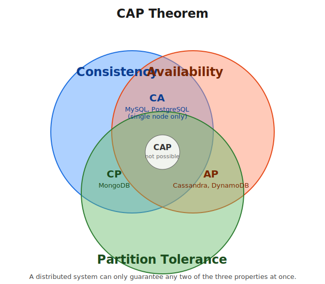

# CAP Theorem

---

## Table of Contents

1. [Introduction](#1-introduction)
2. [Breaking Down CAP](#2-breaking-down-cap)
   - 2.1 [Consistency](#21-consistency)
   - 2.2 [Availability](#22-availability)
   - 2.3 [Partition Tolerance](#23-partition-tolerance)
3. [The CAP Theorem Statement](#3-the-cap-theorem-statement)
   - 3.1 [Venn Diagram](#31-venn-diagram)
4. [Worked Example: Primary–Replica Architecture](#4-worked-example-primaryreplica-architecture)
5. [CAP Theorem and NoSQL Databases](#5-cap-theorem-and-nosql-databases)
6. [Types of Distributed Databases](#6-types-of-distributed-databases)
   - 6.1 [CA Databases](#61-ca-databases)
   - 6.2 [CP Databases](#62-cp-databases)
   - 6.3 [AP Databases](#63-ap-databases)
7. [Summary Table](#7-summary-table)

---

## 1. Introduction

CAP theorem is one of the most basic and important concepts in **Distributed Databases**. It is useful to understand because it helps in designing an efficient distributed system for a given business use case — every distributed database design ends up making a trade-off described by this theorem.

---

## 2. Breaking Down CAP

CAP stands for three properties of a distributed system: **C**onsistency, **A**vailability, and **P**artition Tolerance.

### 2.1 Consistency

Data should be **consistent across all nodes** in the system.

- In a consistent system, all nodes see the same data simultaneously.
- If a read operation is performed, it should return the value of the **most recent write** operation — no matter which node the client connects to.
- When data is written to a single node, it must then be **replicated** across the other nodes so every node reflects the same state.

### 2.2 Availability

The system remains **operational at all times**.

- Every request gets a response, regardless of the individual state of the nodes.
- The system keeps operating even if multiple nodes are down.
- Unlike a consistent system, there is **no guarantee** that the response returned is the most recent write — it just guarantees *a* response.

### 2.3 Partition Tolerance

The system continues to function even when there is a **break in communication (a "partition")** between nodes.

- A partition means messages between nodes may be dropped or delayed.
- A partition-tolerant system does **not fail** just because of this communication breakdown.
- To achieve partition tolerance, records must be replicated across combinations of nodes and networks.

---

## 3. The CAP Theorem Statement

> A distributed system can only provide **two out of the three** properties — Consistency, Availability, and Partition Tolerance — **simultaneously**.

The theorem formalizes the trade-off between **consistency and availability** whenever a partition occurs. Since partitions are a reality of any network-based distributed system, in practice the real choice a designer makes is between **C** and **A** — **P** is not really optional.

### 3.1 Venn Diagram



The diagram shows the three properties as overlapping circles. A real distributed system can only ever sit in the **CA**, **CP**, or **AP** region — the center region where all three properties hold (**CAP**) is not achievable once a partition happens.

| Region | Properties Guaranteed | Property Sacrificed | Example |
|--------|-----------------------|----------------------|---------|
| CA | Consistency + Availability | Partition Tolerance | MySQL, PostgreSQL (single node) |
| CP | Consistency + Partition Tolerance | Availability | MongoDB |
| AP | Availability + Partition Tolerance | Consistency | Cassandra, DynamoDB |

---

## 4. Worked Example: Primary–Replica Architecture

*(This is a personal walk-through of how the trade-off plays out in a real setup.)*

Say we divide our database into 2 nodes as load increases: a **primary node** and a **replica node**.

- The **primary** node handles all **write** operations.
- The **replica** node handles **read** operations.

```
        WRITE                         READ
          │                             │
          ▼                             ▼
   ┌─────────────┐   replication  ┌─────────────┐
   │   Primary    │ ─────────────▶ │   Replica    │
   │    Node      │                │    Node      │
   └─────────────┘                └─────────────┘
```

Now, when a **partition** occurs between the primary and the replica, we are forced to give up one of two things:

| If we choose... | What happens |
|------------------|---------------|
| **Availability** | The replica keeps serving reads, but the write from the primary hasn't reached it yet → data is **eventually consistent**, so **consistency is lost** during the partition. |
| **Consistency** | We **shut down the replica node** so it can't serve stale reads until the partition is fixed → the replica becomes unreachable, so **availability is lost**. |

This single example captures the essence of the CAP trade-off: during a partition, a distributed system must pick between staying consistent or staying available — it cannot guarantee both.

---

## 5. CAP Theorem and NoSQL Databases

NoSQL databases are well suited for distributed networks — they allow **horizontal scaling** and can scale quickly across multiple nodes. When choosing which NoSQL database to use for a project, the CAP theorem is an important factor to keep in mind, since different NoSQL databases make different C/A/P trade-offs.

---

## 6. Types of Distributed Databases

### 6.1 CA Databases

**Consistency + Availability** are guaranteed, because there is only **one node** — so there's no possibility of a network partition between nodes in the first place.

- CA databases can't deliver **fault/partition tolerance**.
- In any real distributed system, partitions are bound to happen at some point, which makes a pure CA setup impractical for scaled-out systems.
- Some relational databases such as **MySQL** or **PostgreSQL** are typically run this way (consistent and available) when deployed to nodes using simple replication rather than true multi-node distribution.

### 6.2 CP Databases

**Consistency + Partition Tolerance** are guaranteed, **Availability is sacrificed**.

- When a partition occurs, the system turns off the inconsistent nodes until the partition is fixed.
- **MongoDB** is a classic example — a NoSQL, document-based, schema-less DBMS.
- It is structured so that only **one primary node** receives all write requests in a given replica set; secondary nodes replicate data from the primary, so if the primary fails, a secondary can step in.
- **Use case:** In a banking system, availability matters less than consistency — you'd rather the system be briefly unavailable than show an incorrect balance. This is why CP systems like MongoDB fit this use case.

### 6.3 AP Databases

**Availability + Partition Tolerance** are guaranteed, **Consistency is sacrificed**.

- During a partition, all nodes remain available, but they may not all be updated.
- If a user reads from a "stale" node, they may not get the most up-to-date data.
- Once the partition is resolved, most AP databases sync nodes to restore consistency (**eventual consistency**).
- **Apache Cassandra** is a classic example — a NoSQL database with **no primary node**, so all nodes stay available, and users re-sync their data once a partition resolves.
- **Use case:** For apps like Facebook, availability is valued more than perfect consistency — so AP databases like **Cassandra** or **Amazon DynamoDB** are preferred.

---

## 7. Summary Table

| Property | Meaning | Guarantee Given Up When Combined With Partition |
|----------|---------|----------------------------------------------------|
| **Consistency (C)** | All nodes return the same, most recent data on every read | Availability |
| **Availability (A)** | Every request gets a response, even if some nodes are down | Consistency |
| **Partition Tolerance (P)** | System keeps working despite dropped/delayed messages between nodes | — (required in real distributed systems) |

| Type | Guarantees | Sacrifices | Example DB(s) | Typical Use Case |
|------|-----------|------------|----------------|-------------------|
| **CA** | Consistency, Availability | Partition Tolerance | MySQL, PostgreSQL (single node) | Small/non-distributed systems |
| **CP** | Consistency, Partition Tolerance | Availability | MongoDB | Banking systems |
| **AP** | Availability, Partition Tolerance | Consistency | Cassandra, DynamoDB | Social media apps (e.g. Facebook) |
