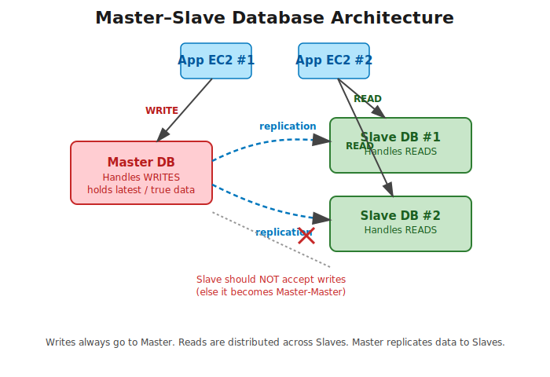
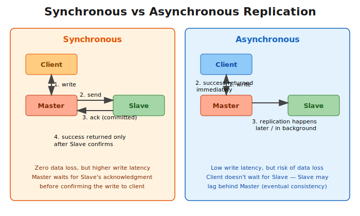

# Master–Slave Database Concept

---

## Table of Contents

1. [Introduction](#1-introduction)
2. [The Problem: Single Database Bottleneck](#2-the-problem-single-database-bottleneck)
3. [Master–Slave Architecture](#3-masterslave-architecture)
   - 3.1 [Architecture Diagram](#31-architecture-diagram)
   - 3.2 [Master DB](#32-master-db)
   - 3.3 [Slave DB](#33-slave-db)
4. [What If a Slave Receives a Write Query?](#4-what-if-a-slave-receives-a-write-query)
5. [Database Replication](#5-database-replication)
   - 5.1 [Synchronous Replication](#51-synchronous-replication)
   - 5.2 [Asynchronous Replication](#52-asynchronous-replication)
   - 5.3 [Sync vs Async Diagram](#53-sync-vs-async-diagram)
   - 5.4 [Real-World Use Cases](#54-real-world-use-cases)
6. [CQRS – Command Query Responsibility Segregation](#6-cqrs--command-query-responsibility-segregation)
7. [Advantages of Master–Slave](#7-advantages-of-masterslave)
8. [Summary Table](#8-summary-table)

---

## 1. Introduction

Master-Slave is a general **database scaling pattern** used to optimize I/O in a system where the number of requests becomes too high for a single DB server to handle efficiently. It's covered as **Pattern 3** in the Database Scaling Patterns lecture, closely related to **CQRS (Command Query Responsibility Segregation)**.

The core idea: separate **write** operations from **read** operations, physically, onto different machines.

---

## 2. The Problem: Single Database Bottleneck

Suppose we're running an app on multiple AWS instances but backing it with a **single database**. If that one database crashes, the **availability** of the entire app is affected — everything goes down with it.

If a site receives a lot of traffic and only has one database to serve it, that single machine gets overloaded with both reading and writing requests at once, making the entire system slow for every user on the site.

**Solution:** Add one (or more) additional databases as **replicas**. Some of the requests from app instances get redirected to the replica(s) instead of all hitting a single DB.

---

## 3. Master–Slave Architecture

### 3.1 Architecture Diagram

- App instances send **write** requests to the **Master DB** and **read** requests to the **Slave DB(s)**.
- The Master replicates its data to the Slaves so they stay up to date.
- A Slave is not allowed to accept writes directly (explained in [Section 4](#4-what-if-a-slave-receives-a-write-query)).

### 3.2 Master DB

- The **primary / master DB** always holds the **latest, true data**.
- All **write** operations are directed here.

### 3.3 Slave DB

- The **replica / slave DB** serves **read** operations only.
- Data reaches the slave via **replication** from the master.

---

## 4. What If a Slave Receives a Write Query?

This should either be **ignored** or **never allowed** in the first place.

If we *did* allow it, we would then need to propagate those changes back into the master DB — at which point the architecture stops being Master-Slave and effectively becomes a **Master-Master architecture**, where every node can accept writes and all nodes must sync changes with each other. This adds a lot of complexity (conflict resolution, bidirectional sync) that a simple Master-Slave setup is specifically designed to avoid.

---

## 5. Database Replication

**Replication** is the mechanism that takes care of distributing data from the Master machine to the Slave machines, keeping them in sync. Replication can happen in one of two ways: **synchronous** or **asynchronous**.

### 5.1 Synchronous Replication

In synchronous replication, the master **waits** for the slave to confirm it has received and applied the write before the master reports success back to the client.

**How it works:**
1. Client sends a write to the Master.
2. Master forwards the write to the Slave.
3. Slave applies the write and sends an acknowledgment back.
4. Only after that acknowledgment does the Master confirm success to the client.

**Trade-off:** Guarantees **zero data loss** (the slave is always as current as the master) but adds **latency** to every write, since the master must wait on a network round-trip to the slave before responding.

### 5.2 Asynchronous Replication

In asynchronous replication, the master commits the write and responds to the client **immediately**, then replicates the change to the slave in the background, independently of the client's request.

**How it works:**
1. Client sends a write to the Master.
2. Master applies the write and immediately returns success to the client.
3. Master pushes the change to the Slave separately/later.

**Trade-off:** Much **lower write latency**, since the client isn't waiting on the slave at all. But there's a **risk of data loss**: if the master crashes right after step 2 but before the replication in step 3 completes, that write may never reach the slave. This is also why async-replicated slaves are described as **eventually consistent** rather than strictly consistent.

### 5.3 Sync vs Async Diagram

### 5.4 Real-World Use Cases

| Replication Type | Priority | Real-World Use Case |
|---|---|---|
| **Synchronous** | Correctness over speed | **Financial / banking applications** — e.g. money transfers, ledger updates, payment processing. A transaction must never be "lost" or shown as successful if it isn't durably recorded on the replica too, since that could mean money appears/disappears incorrectly. |
| **Synchronous** | Correctness over speed | Systems with strict regulatory or audit requirements (e.g. stock trading systems, healthcare records) where consistency is non-negotiable. |
| **Asynchronous** | Speed / availability over instant consistency | **Social media apps** — e.g. Facebook/Instagram likes, comments, feed updates. A slight delay in a like count syncing across regions is an acceptable trade-off for a fast, responsive experience. |
| **Asynchronous** | Speed / availability over instant consistency | **Content delivery / read-heavy apps** — e.g. blogs, news sites, product catalogs — where read replicas across geographic regions are updated a few seconds later without any real business impact. |
| **Asynchronous** | Speed / availability over instant consistency | Analytics/logging pipelines, where slightly stale data in a replica is fine as long as writes to the primary are fast. |

**Rule of thumb:** if being briefly *unavailable* is more acceptable than being briefly *wrong*, use **synchronous** replication (e.g. banking). If being briefly *stale* is more acceptable than being *slow*, use **asynchronous** replication (e.g. social media).

---

## 6. CQRS – Command Query Responsibility Segregation

Master-Slave is essentially an application of the broader **CQRS** pattern at the database level:

- A single scaled-up machine eventually isn't able to handle all read/write requests together.
- The solution is to **separate read and write operations onto physically different machines**.
- Typically: **2 or more machines act as replicas** to the primary machine.
- **All read queries** go to the replicas.
- **All write queries** go to the primary.

**Example growth scenario:** A business starts with one primary database. As the business grows and expands to 2 more cities, the primary machine is no longer able to handle all the incoming write requests — this is the point where teams introduce Master-Slave replication and start routing reads to replicas so the primary can focus on writes.

---

## 7. Advantages of Master–Slave

| Advantage | Explanation |
|---|---|
| **Backup / resilience** | If a write fails or the master goes down, reads can still be served from the slave — the app doesn't go fully offline. |
| **Scale out read operations** | Multiple slaves can be added so read traffic is spread across several machines instead of hammering one DB. |
| **Increased availability** | With more than one database serving the app, a single DB failure doesn't take the whole system down. |
| **Parallelism** | Reads and writes can happen on different machines at the same time instead of queuing on a single server. |
| **Reduced latency** | Read replicas can be placed closer to users (e.g. in different regions), and since reads no longer compete with writes on the same machine, response times improve. |

---

## 8. Summary Table

| Concept | Description |
|---|---|
| **Master DB** | Holds the latest/true data; handles all writes |
| **Slave DB** | Read-only replica of the master; handles all reads |
| **Replication** | Process of copying data from master to slave(s) |
| **Synchronous Replication** | Master waits for slave's ack before confirming write → strong consistency, higher latency. Used in **financial systems**. |
| **Asynchronous Replication** | Master confirms write immediately, replicates in background → low latency, eventual consistency. Used in **social media / read-heavy apps**. |
| **Slave accepting writes** | Not allowed — doing so turns the setup into a **Master-Master architecture** |
| **CQRS** | The broader pattern of separating read (query) and write (command) responsibility onto different machines |
