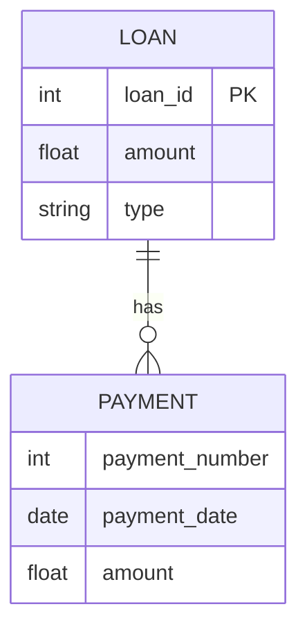
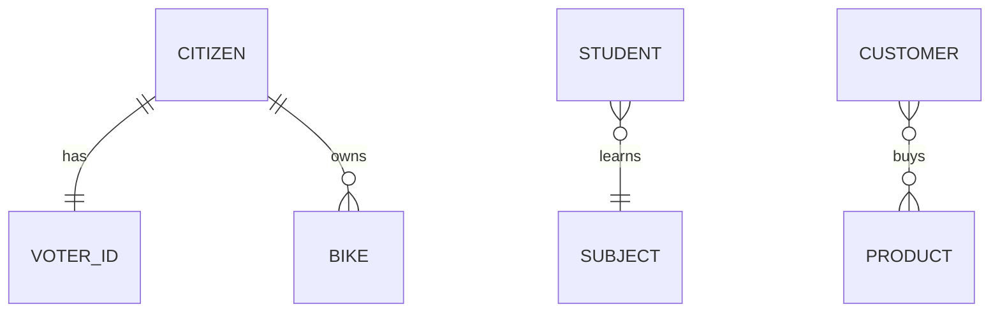
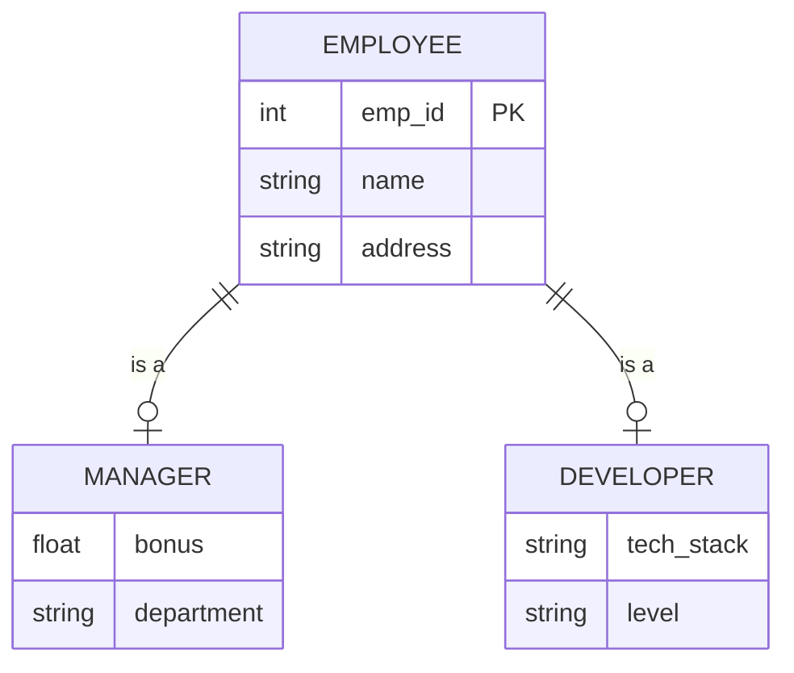
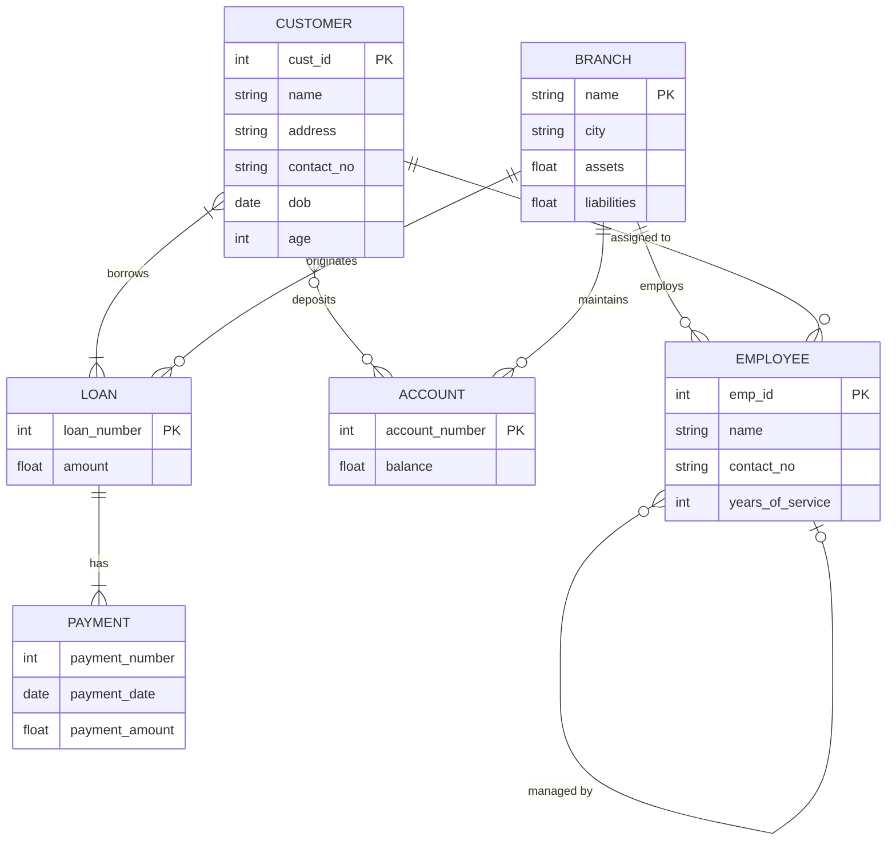

# ER Model

---

## Table of Contents

1. [ER Model](#1-er-model)
   - 1.1 [Entity](#11-entity)
   - 1.2 [Strong vs Weak Entity](#12-strong-vs-weak-entity)
   - 1.3 [Entity Set](#13-entity-set)
   - 1.4 [Attributes](#14-attributes)
   - 1.5 [Relationship](#15-relationship)
2. [Relationship Constraints](#2-relationship-constraints)
   - 2.1 [Mapping Cardinality](#21-mapping-cardinality)
   - 2.2 [Participation Constraints](#22-participation-constraints)
3. [Extended ER Features](#3-extended-er-features)
   - 3.1 [Specialization](#31-specialization)
   - 3.2 [Generalization](#32-generalization)
   - 3.3 [Participation Inheritance](#33-participation-inheritance)
   - 3.4 [Aggregation](#34-aggregation)
4. [Steps to Make an ER Diagram](#4-steps-to-make-an-er-diagram)
5. [ER Model of a Banking System](#5-er-model-of-a-banking-system)

---

## 1. ER Model

An **ER (Entity-Relationship) model** is a data model that consists of **entities** and **relationships** among those entities.

---

### 1.1 Entity

An **entity** has attributes which define its properties or features, and it can be **uniquely identified** through a primary attribute (also called a primary key).

---

### 1.2 Strong vs Weak Entity

- **Strong entity** — can be uniquely identified through its own primary key.
- **Weak entity** — depends on some other strong entity; does not have its own primary key.

> **Example:** A `Loan` table can be a strong entity, while a `Payment` table needs another table to define itself — therefore it is a weak entity.



---

### 1.3 Entity Set

An **entity set** is a set of entities that share the same attributes.

---

### 1.4 Attributes

**Attributes** are a set of features that describe an entity.

**Types of Attributes:**

| Type | Description | Example |
|---|---|---|
| **Simple** | Cannot be divided further | Account number |
| **Composite** | Can be divided into subparts | Name → First, Middle, Last |
| **Single-valued** | Holds only one value | Student ID |
| **Multi-valued** | Can hold more than one value | Multiple phone numbers |
| **Derived** | Can be derived from other related attributes | Age (derived from DOB) |

---

### 1.5 Relationship

A **relationship** is an association between two entities.

**Types:**

- **Strong relationship** — between two strong entities.
- **Weak relationship** — between a weak entity and its strong entity.

**Degree of Relationship** — the number of entities participating in a relationship:

| Degree | Description | Example |
|---|---|---|
| **Unary** | Only 1 entity participates | Employee *manages* Employee |
| **Binary** | 2 entities participate | Bank *gives* Loan |
| **Ternary** | 3 entities participate | Employee is a Manager, Employee is a Junior Dev |

---

## 2. Relationship Constraints

---

### 2.1 Mapping Cardinality

**Mapping cardinality** defines how many entities one entity can be associated with.

| Type | Description | Example |
|---|---|---|
| **One to One** | One entity maps to exactly one other | Citizen has Voter ID |
| **One to Many** | One entity maps to multiple others | Citizen has Bikes |
| **Many to One** | Multiple entities map to one | Subjects learned by a Student |
| **Many to Many** | Multiple entities map to multiple others | Customers buy Products |



---

### 2.2 Participation Constraints

- **Total participation** — every entity in the entity set must be involved in at least one relationship.
  > **Example:** A `Loan` cannot exist without a `Customer` entity. Every loan must have a customer.

- **Partial participation** — not all entities in the entity set need to be involved in a relationship.
  > **Example:** A `Customer` can exist without having a `Loan`.

> **Note:** A weak entity always has a **total participation** constraint with respect to its identifying strong entity.

---

## 3. Extended ER Features

---

### 3.1 Specialization

**Specialization** is the process of splitting an entity set into sub-entities based on their functionalities and features. The original entity acts as a **parent class** and the sub-entities act as **child classes** — similar to inheritance in OOP.

- There is an **"is a"** relationship between the parent class and the subclass.

**Why use it:**
- Certain attributes may be applicable to only a few entities of a parent entity set.
- Avoids redundancy.



---

### 3.2 Generalization

**Generalization** is the reverse of specialization. When certain properties of two entities overlap, we create a new **generalized entity set** that acts as a superclass.

- It is a **bottom-up approach**.

**Why use it:** Reduces redundancy.

---

### 3.3 Participation Inheritance

If a **parent entity set** participates in a relationship, then its **child entity sets** will also participate in that relationship.

---

### 3.4 Aggregation

**Aggregation** is used to express a relationship among relationships. Abstraction is applied to treat relationships as higher-level entities, which avoids redundancy.

> **Example:**

```
[Student] --- (attends) --- [Semester]
                   |
                 (has)
                   |
              [Subject]
```

Here, the relationship between `Student` and `Semester` is aggregated and treated as a higher-level entity that itself has a relationship with `Subject`.

---

## 4. Steps to Make an ER Diagram

1. **Identify entity sets**
2. **Identify attributes** and their data types
3. **Identify relationships** and constraints (mapping cardinality, participation)

---

## 5. ER Model of a Banking System

---

### a. Collect DB Requirements

Understand what the client wants. For a banking system, this includes: branches, customers, accounts, loan facility, customer-banker association, employees, types of accounts, etc.

---

### b. Identify Entity Sets

`Branch` · `Customer` · `Employee` · `Account` · `Loan` · `Payment`

---

### c. Identify Attributes

| Entity | Attributes |
|---|---|
| **Branch** | name, city, assets, liabilities |
| **Customer** | cust_id *(PK)*, name, address *(composite)*, contact_no *(multivalued)*, dob, age *(derived)* |
| **Employee** | emp_id *(PK)*, name, contact_no, dependent_name *(multivalued)*, years_of_service *(derived)* |
| **Account** | account_number *(PK)*, balance |
| **Loan** | loan_number *(PK)*, amount |
| **Payment** | payment_number, payment_date, payment_amount |

---

### d. Relationships and Constraints

| Relationship | Constraint |
|---|---|
| Customer **borrows** Loan | Total participation (customer side) |
| Loan **originated by** Branch | Many-to-One (N:1) |
| Loan **has** Payment | Weak relationship (Payment is a weak entity) |
| Customer **deposits** Account | Many-to-Many (M:N) |
| Employee **managed by** Employee | Many-to-One (N:1) — unary relationship |

---

### ER Diagram — Banking System


