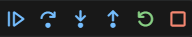

# 🐛 Debugging in VS Code

> A reference guide covering essential debugging tools and techniques in Visual Studio Code — including breakpoints, watch panels, call stacks, and advanced features like logpoints and conditional breakpoints.

---

## 📑 Table of Contents

1. [Core Controls](#1-core-controls)
2. [Breakpoints](#2-breakpoints)
   - [2.1 Conditional Breakpoints](#21-conditional-breakpoints)
   - [2.2 Logpoints](#22-logpoints)
   - [2.3 Exception Breakpoints](#23-exception-breakpoints)
3. [Watch Panel](#3-watch-panel)
4. [Call Stack](#4-call-stack)

---

## 1. Core Controls

These are the primary controls available in the VS Code debug toolbar once a debugging session is active.



| Control | Description |
|--------|-------------|
| **Continue** | Resumes execution and runs until the next breakpoint is hit |
| **Step Over** | Executes the current line and moves to the next one |
| **Step Into** | Steps inside a function call to debug it line by line |
| **Step Out** | Exits the current function and returns to the caller |

---

## 2. Breakpoints

A **breakpoint** is a marker that tells VS Code to pause code execution at a specific line, allowing you to inspect the program state at that point.

To add a breakpoint, click in the gutter (left margin) next to a line number, or press `F9` on the desired line. A red dot will appear indicating the breakpoint is set.

---

### 2.1 Conditional Breakpoints

A **conditional breakpoint** pauses the program only when a specified condition is met. This is particularly useful inside loops where you only want to stop at a particular iteration or value.

**To add a conditional breakpoint in VS Code:**

1. Hover over an existing breakpoint in the side
2. Right-click and select **"Edit Breakpoint..."** (or **"Conditional Breakpoint"**)
3. Enter your condition in the input bar

**Example condition:**

```python
variable_value == 5
```

> The debugger will only pause at this line when `variable_value` equals `5`.

---

### 2.2 Logpoints

A **logpoint** is used in place of a `print()` statement. It logs a message or variable value to the terminal at a specific point in execution — without actually pausing the program.

**To add a logpoint:**

1. Right-click in the gutter next to a line
2. Select **"Add Logpoint..."**
3. Enter the message or expression to log, e.g. `Value is: {variable_value}`

> Logpoints are non-intrusive and ideal for production-like debugging where you don't want to stop execution.

---

### 2.3 Exception Breakpoints

VS Code supports two types of exception breakpoints, configurable in the **Breakpoints** panel in the Debug sidebar:

| Type | Behavior |
|------|----------|
| **Raised Exceptions** | Debugger stops on *any* exception, even if it's caught in a `try/except` block — stops when the error is thrown |
| **Uncaught Exceptions** | Debugger stops only when an exception is *not* caught — useful for finding unhandled errors |

---

## 3. Watch Panel

The **Watch panel** lets you monitor specific variables or expressions throughout execution. It updates in real time as you step through code.

**Key uses:**

- Monitor a variable's value across multiple steps
- Evaluate expressions (e.g. `len(my_list)`)
- Drill into specific values inside a complex dictionary or JSON object

**Example watch expression:**

```python
response["data"]["items"][0]["name"]
```

> You can add expressions by clicking the **+** icon in the Watch panel and typing the expression directly.

---

## 4. Call Stack

The **Call Stack** panel shows the chain of function calls that led to the current point of execution.

- Functions are pushed onto the stack as they are called
- They are popped off as they return
- Clicking a frame in the call stack lets you inspect the local variables at that level

> This is especially useful for tracing how deeply nested functions are being invoked and understanding the execution flow of your program.
